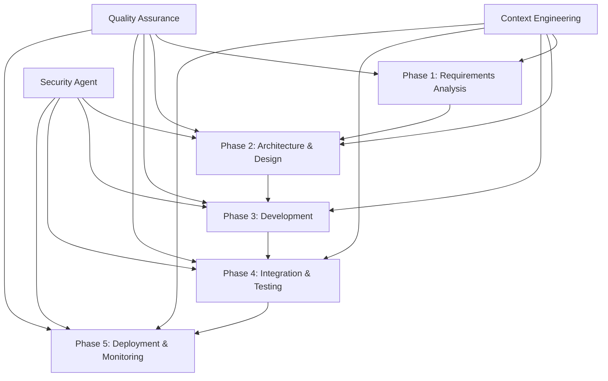

# Agentic Vibe Coding Workflow

## Overview

The Agentic Vibe Coding Workflow represents a revolutionary approach to software development where specialized AI agents collaborate autonomously to transform business requirements into production-ready software. <mcreference link="https://aravindakumar.medium.com/code-generation-how-agentic-workflows-transform-requirements-into-code-61aecd683cbb" index="1">1</mcreference> This workflow leverages the collective intelligence of multiple specialized agents, each with deep domain expertise, working in harmony to deliver the Anwar Sales Management System.

## Workflow Philosophy

### Core Principles

1. **Autonomous Collaboration**: Agents operate independently while maintaining seamless collaboration
2. **Context-Driven Intelligence**: Every decision is informed by comprehensive context engineering
3. **Continuous Quality Assurance**: Quality is built into every step, not added as an afterthought
4. **Adaptive Learning**: The workflow continuously learns and improves from each iteration
5. **Human-AI Partnership**: Strategic human oversight with tactical AI execution

### Vibe Coding Characteristics

```yaml
Vibe Coding Attributes:
  flow_state:
    - "Uninterrupted development momentum"
    - "Seamless agent handoffs"
    - "Minimal context switching overhead"

  collective_intelligence:
    - "Distributed expertise across agents"
    - "Emergent problem-solving capabilities"
    - "Synergistic collaboration patterns"

  adaptive_execution:
    - "Dynamic workflow adjustments"
    - "Real-time quality optimization"
    - "Intelligent error recovery"

  contextual_awareness:
    - "Deep understanding of business domain"
    - "Technical constraint awareness"
    - "Stakeholder need alignment"
```

## Workflow Architecture

### Phase-Based Execution Model



### Agent Orchestration Matrix

| Phase       | Primary Agents                                   | Supporting Agents             | Deliverables                                | Quality Gates           |
| ----------- | ------------------------------------------------ | ----------------------------- | ------------------------------------------- | ----------------------- |
| **Phase 1** | Requirements Analysis                            | Security, Context Engineering | Requirements Specification                  | Stakeholder Approval    |
| **Phase 2** | Architecture Design, Database Design, API Design | Security, Context Engineering | System Architecture, Data Models, API Specs | Technical Review        |
| **Phase 3** | Frontend Development, Backend Development        | Security, Testing             | Application Components                      | Code Review, Unit Tests |
| **Phase 4** | Testing, Security                                | All Development Agents        | Test Results, Security Assessment           | Quality Validation      |
| **Phase 5** | Deployment, Monitoring                           | Security                      | Production System                           | Go-Live Approval        |

## Detailed Workflow Phases

### Phase 1: Requirements Analysis & Context Engineering

#### Objectives

- Transform business needs into structured requirements
- Establish comprehensive context foundation
- Validate stakeholder alignment
- Define success criteria

#### Agent Activities

**Requirements Analysis Agent**

```yaml
Activities:
  stakeholder_engagement:
    - "Conduct structured stakeholder interviews"
    - "Analyze existing documentation and systems"
    - "Identify business process workflows"
    - "Define user personas and use cases"

  requirement_extraction:
    - "Extract functional requirements"
    - "Identify non-functional requirements"
    - "Document business rules and constraints"
    - "Define acceptance criteria"

  validation_and_prioritization:
    - "Validate requirements with stakeholders"
    - "Prioritize requirements by business value"
    - "Identify dependencies and conflicts"
    - "Create requirements traceability matrix"

  deliverables:
    - "Comprehensive Requirements Specification"
    - "User Story Backlog"
    - "Business Process Models"
    - "Stakeholder Approval Documentation"
```

**Context Engineering Support**

```yaml
Context_Capture:
  business_context:
    - "Organization structure and culture"
    - "Business objectives and success metrics"
    - "Stakeholder roles and responsibilities"
    - "Market and competitive landscape"

  domain_context:
    - "Sales process workflows"
    - "Customer management practices"
    - "Communication patterns"
    - "Reporting and analytics needs"

  technical_context:
    - "Existing technology landscape"
    - "Integration requirements"
    - "Performance expectations"
    - "Security and compliance needs"
```

#### Quality Gates

- **Stakeholder Sign-off**: All key stakeholders approve requirements
- **Completeness Check**: All critical business processes covered
- **Feasibility Validation**: Technical feasibility confirmed
- **Context Validation**: Comprehensive context captured and validated

### Phase 2: Architecture & Design

#### Objectives

- Design scalable and maintainable system architecture
- Create optimal data models and storage strategies
- Define comprehensive API specifications
- Establish security and integration patterns

#### Agent Activities

**Architecture Design Agent**

```yaml
Activities:
  system_architecture:
    - "Design overall system architecture"
    - "Define component interactions"
    - "Establish integration patterns"
    - "Create deployment architecture"

  technology_selection:
    - "Evaluate and select technology stack"
    - "Define development frameworks"
    - "Choose deployment platforms"
    - "Select monitoring and analytics tools"

  scalability_design:
    - "Design for horizontal scalability"
    - "Plan performance optimization strategies"
    - "Define caching and data strategies"
    - "Create disaster recovery plans"

  deliverables:
    - "System Architecture Document"
    - "Technology Stack Specification"
    - "Deployment Architecture"
    - "Integration Patterns Guide"
```

**Database Design Agent**

```yaml
Activities:
  data_modeling:
    - "Design conceptual data models"
    - "Create logical database schemas"
    - "Optimize physical data structures"
    - "Define data relationships and constraints"

  storage_strategy:
    - "Design multi-platform storage strategy"
    - "Plan Google Sheets integration"
    - "Design Firebase/Firestore schemas"
    - "Plan Cloud SQL implementations"

  performance_optimization:
    - "Design indexing strategies"
    - "Plan query optimization"
    - "Design caching mechanisms"
    - "Create data archival strategies"

  deliverables:
    - "Comprehensive Data Model"
    - "Database Schema Specifications"
    - "Data Migration Plans"
    - "Performance Optimization Guide"
```

**API Design Agent**

```yaml
Activities:
  api_specification:
    - "Design RESTful API endpoints"
    - "Create GraphQL schemas"
    - "Define WebSocket interfaces"
    - "Design webhook specifications"

  integration_design:
    - "Design Google Workspace integrations"
    - "Plan WhatsApp Business API integration"
    - "Create third-party service integrations"
    - "Design microservice communications"

  security_and_performance:
    - "Design authentication and authorization"
    - "Plan rate limiting and throttling"
    - "Create API versioning strategies"
    - "Design error handling patterns"

  deliverables:
    - "OpenAPI Specifications"
    - "Integration Architecture"
    - "API Security Guidelines"
    - "SDK Design Documents"
```

**UI Designer Agent**

```yaml
Activities:
  user_experience_design:
    - "Conduct user experience research"
    - "Create user journey maps"
    - "Design interaction patterns"
    - "Develop accessibility standards"

  interface_design:
    - "Create design system components"
    - "Design responsive layouts"
    - "Develop visual design language"
    - "Create design prototypes"

  design_system_development:
    - "Build component library"
    - "Define design tokens"
    - "Create style guides"
    - "Establish design patterns"

  deliverables:
    - "UI/UX Design System"
    - "Component Library"
    - "Design Prototypes"
    - "Accessibility Guidelines"
```

**Prompt Builder Agent**

```yaml
Activities:
  prompt_engineering:
    - "Create agent-specific prompts"
    - "Develop context-aware prompts"
    - "Design performance optimization prompts"
    - "Build quality assurance prompts"

  prompt_optimization:
    - "Optimize prompt effectiveness"
    - "Enhance agent collaboration prompts"
    - "Improve code generation prompts"
    - "Refine testing and validation prompts"

  prompt_management:
    - "Maintain prompt libraries"
    - "Version control prompt templates"
    - "Monitor prompt performance"
    - "Update prompts based on feedback"

  deliverables:
    - "Agent Prompt Libraries"
    - "Context-Aware Prompt Templates"
    - "Prompt Performance Metrics"
    - "Prompt Optimization Guidelines"
```

**Security Agent (Cross-Phase)**

```yaml
Phase_2_Activities:
  security_architecture:
    - "Design security architecture"
    - "Plan identity and access management"
    - "Create data protection strategies"
    - "Design threat detection systems"

  compliance_planning:
    - "Plan GDPR compliance measures"
    - "Design audit logging systems"
    - "Create data retention policies"
    - "Plan security monitoring"

  deliverables:
    - "Security Architecture Document"
    - "Compliance Implementation Plan"
    - "Threat Model Analysis"
    - "Security Testing Strategy"
```

#### Quality Gates

- **Architecture Review**: Technical architecture approved by experts
- **Security Validation**: Security architecture meets requirements
- **Performance Validation**: Architecture meets performance targets
- **Integration Feasibility**: All integrations technically validated
- **UI Design Approval**: User interface design system approved
- **Prompt Optimization**: Agent prompts optimized and validated

### Phase 3: Development

#### Objectives

- Implement user interfaces and user experiences
- Develop server-side logic and data processing
- Create robust API implementations
- Ensure code quality and maintainability

#### Agent Activities

**Frontend Development Agent**

```yaml
Activities:
  ui_implementation:
    - "Implement responsive user interfaces"
    - "Create Progressive Web App (PWA)"
    - "Develop mobile-optimized experiences"
    - "Implement accessibility features"
    - "Integrate UI design system components"

  ux_development:
    - "Implement user workflow optimizations"
    - "Create intuitive navigation patterns"
    - "Develop real-time user feedback"
    - "Implement offline capabilities"
    - "Apply UX design patterns"

  integration_development:
    - "Integrate with backend APIs"
    - "Implement real-time data synchronization"
    - "Create third-party service integrations"
    - "Develop authentication flows"

  prompt_driven_development:
    - "Utilize context-aware code generation"
    - "Apply quality-focused prompting"
    - "Implement performance-driven prompts"
    - "Use collaboration optimization prompts"

  deliverables:
    - "Production-Ready Frontend Application"
    - "Component Library"
    - "User Interface Documentation"
    - "Frontend Testing Suite"
```

**Backend Development Agent**

```yaml
Activities:
  server_logic:
    - "Implement Google Apps Script functions"
    - "Develop Firebase Cloud Functions"
    - "Create data processing workflows"
    - "Implement business logic layers"

  api_implementation:
    - "Implement RESTful API endpoints"
    - "Create GraphQL resolvers"
    - "Develop WebSocket handlers"
    - "Implement webhook processors"

  data_management:
    - "Implement database operations"
    - "Create data synchronization logic"
    - "Develop caching mechanisms"
    - "Implement data validation"

  prompt_driven_development:
    - "Utilize context-aware code generation"
    - "Apply quality-focused prompting"
    - "Implement performance-driven prompts"
    - "Use collaboration optimization prompts"

  deliverables:
    - "Production-Ready Backend Services"
    - "API Implementation"
    - "Data Processing Workflows"
    - "Backend Testing Suite"
```

#### Quality Gates

- **Code Review**: All code reviewed and approved
- **Unit Testing**: Comprehensive unit test coverage
- **Integration Testing**: Component integration validated
- **Performance Testing**: Performance targets met

### Phase 4: Integration & Testing

#### Objectives

- Validate complete system functionality
- Ensure security and compliance requirements
- Verify performance and scalability
- Validate user experience and accessibility

#### Agent Activities

**Testing Agent**

```yaml
Activities:
  test_strategy_execution:
    - "Execute comprehensive test plans"
    - "Perform automated testing workflows"
    - "Conduct manual testing scenarios"
    - "Validate cross-platform compatibility"

  performance_testing:
    - "Execute load and stress testing"
    - "Validate scalability requirements"
    - "Test database performance"
    - "Validate API response times"

  user_experience_testing:
    - "Conduct usability testing"
    - "Validate accessibility compliance"
    - "Test mobile responsiveness"
    - "Validate offline functionality"

  deliverables:
    - "Comprehensive Test Results"
    - "Performance Test Reports"
    - "User Experience Validation"
    - "Bug Reports and Resolutions"
```

**Security Agent**

```yaml
Phase_4_Activities:
  security_testing:
    - "Conduct penetration testing"
    - "Perform vulnerability assessments"
    - "Test authentication and authorization"
    - "Validate data encryption"

  compliance_validation:
    - "Validate GDPR compliance"
    - "Test audit logging functionality"
    - "Verify data retention policies"
    - "Validate security monitoring"

  deliverables:
    - "Security Assessment Report"
    - "Compliance Validation Results"
    - "Penetration Test Results"
    - "Security Recommendations"
```

#### Quality Gates

- **Functional Validation**: All functional requirements tested and passed
- **Security Clearance**: Security testing passed with no critical issues
- **Performance Validation**: Performance requirements met
- **User Acceptance**: User acceptance testing completed successfully

### Phase 5: Deployment & Monitoring

#### Objectives

- Deploy system to production environment
- Establish monitoring and alerting
- Ensure operational readiness
- Enable continuous improvement

#### Agent Activities

**Deployment Agent**

```yaml
Activities:
  deployment_execution:
    - "Execute automated deployment pipelines"
    - "Configure production environments"
    - "Implement blue-green deployments"
    - "Validate deployment success"

  infrastructure_management:
    - "Provision cloud infrastructure"
    - "Configure load balancers and CDNs"
    - "Set up database clusters"
    - "Configure backup and recovery"

  ci_cd_implementation:
    - "Implement continuous integration"
    - "Set up automated testing pipelines"
    - "Configure deployment automation"
    - "Implement rollback mechanisms"

  deliverables:
    - "Production Deployment"
    - "CI/CD Pipeline Configuration"
    - "Infrastructure Documentation"
    - "Deployment Runbooks"
```

**Monitoring Agent**

```yaml
Activities:
  monitoring_setup:
    - "Configure application monitoring"
    - "Set up infrastructure monitoring"
    - "Implement user experience monitoring"
    - "Configure business metrics tracking"

  alerting_configuration:
    - "Set up intelligent alerting"
    - "Configure escalation procedures"
    - "Implement anomaly detection"
    - "Create monitoring dashboards"

  analytics_implementation:
    - "Implement usage analytics"
    - "Set up performance analytics"
    - "Configure business intelligence"
    - "Create reporting automation"

  deliverables:
    - "Comprehensive Monitoring Setup"
    - "Alerting and Escalation Procedures"
    - "Analytics and Reporting Systems"
    - "Operational Dashboards"
```

#### Quality Gates

- **Deployment Validation**: Successful production deployment
- **Monitoring Verification**: All monitoring systems operational
- **Performance Baseline**: Production performance baselines established
- **Go-Live Approval**: Final approval for production release

## Cross-Phase Activities

### Continuous Context Engineering

```yaml
Continuous_Context_Activities:
  context_maintenance:
    - "Regular context validation and updates"
    - "Stakeholder feedback integration"
    - "Context relationship maintenance"
    - "Quality assurance monitoring"

  context_evolution:
    - "Adaptive context refinement"
    - "New context discovery and integration"
    - "Context deprecation and archival"
    - "Context usage optimization"

  context_distribution:
    - "Real-time context synchronization"
    - "Agent-specific context delivery"
    - "Context change notifications"
    - "Context access optimization"
```

### Continuous Security

```yaml
Continuous_Security_Activities:
  threat_monitoring:
    - "Real-time threat detection"
    - "Vulnerability scanning"
    - "Security event analysis"
    - "Incident response coordination"

  compliance_monitoring:
    - "Continuous compliance validation"
    - "Audit trail maintenance"
    - "Policy enforcement monitoring"
    - "Regulatory update integration"

  security_optimization:
    - "Security posture improvement"
    - "Access control optimization"
    - "Security automation enhancement"
    - "Security training and awareness"
```

### Continuous Quality Assurance

```yaml
Continuous_QA_Activities:
  quality_monitoring:
    - "Real-time quality metrics tracking"
    - "Automated quality validation"
    - "Quality trend analysis"
    - "Quality improvement identification"

  process_optimization:
    - "Workflow efficiency analysis"
    - "Agent collaboration optimization"
    - "Quality gate refinement"
    - "Process automation enhancement"

  feedback_integration:
    - "Stakeholder feedback collection"
    - "User experience feedback analysis"
    - "Agent performance feedback"
    - "Continuous improvement implementation"
```

## Workflow Orchestration

### Orchestration Engine

```yaml
Orchestration_Engine:
  workflow_management:
    - "Phase transition coordination"
    - "Agent task scheduling"
    - "Dependency management"
    - "Resource allocation optimization"

  communication_coordination:
    - "Inter-agent message routing"
    - "Context synchronization"
    - "Notification management"
    - "Collaboration facilitation"

  quality_coordination:
    - "Quality gate enforcement"
    - "Validation workflow management"
    - "Exception handling"
    - "Escalation management"

  performance_optimization:
    - "Workflow performance monitoring"
    - "Bottleneck identification"
    - "Resource utilization optimization"
    - "Efficiency improvement"
```

### Decision Making Framework

```yaml
Decision_Framework:
  autonomous_decisions:
    - "Technical implementation choices"
    - "Code optimization decisions"
    - "Testing strategy adjustments"
    - "Performance tuning decisions"

  collaborative_decisions:
    - "Architecture design choices"
    - "Integration approach decisions"
    - "Security implementation strategies"
    - "Quality standard definitions"

  escalated_decisions:
    - "Business requirement changes"
    - "Major architecture modifications"
    - "Security policy exceptions"
    - "Timeline and scope adjustments"

  human_oversight_decisions:
    - "Strategic direction changes"
    - "Stakeholder conflict resolution"
    - "Compliance interpretation"
    - "Final go-live approval"
```

## Success Metrics

### Workflow Efficiency Metrics

```yaml
Efficiency_Metrics:
  time_to_delivery:
    - "Requirements to deployment time"
    - "Phase transition efficiency"
    - "Agent handoff speed"
    - "Quality gate processing time"

  resource_utilization:
    - "Agent utilization rates"
    - "Parallel processing efficiency"
    - "Resource conflict frequency"
    - "Idle time minimization"

  collaboration_effectiveness:
    - "Inter-agent communication quality"
    - "Handoff success rates"
    - "Conflict resolution efficiency"
    - "Knowledge sharing effectiveness"
```

### Quality Metrics

```yaml
Quality_Metrics:
  deliverable_quality:
    - "Requirements completeness"
    - "Architecture quality scores"
    - "Code quality metrics"
    - "Test coverage and effectiveness"

  process_quality:
    - "Quality gate pass rates"
    - "Rework frequency"
    - "Defect escape rates"
    - "Stakeholder satisfaction"

  system_quality:
    - "Performance benchmark achievement"
    - "Security compliance scores"
    - "Reliability metrics"
    - "User experience scores"
```

### Business Impact Metrics

```yaml
Business_Impact_Metrics:
  delivery_success:
    - "On-time delivery rate"
    - "Budget adherence"
    - "Scope completion rate"
    - "Stakeholder satisfaction"

  system_adoption:
    - "User adoption rates"
    - "Feature utilization"
    - "User satisfaction scores"
    - "Business value realization"

  operational_excellence:
    - "System availability"
    - "Performance consistency"
    - "Support ticket volume"
    - "Maintenance efficiency"
```

## Continuous Improvement

### Learning Mechanisms

```yaml
Learning_Mechanisms:
  retrospective_analysis:
    - "Phase completion retrospectives"
    - "Agent performance analysis"
    - "Workflow efficiency reviews"
    - "Quality improvement identification"

  pattern_recognition:
    - "Successful pattern identification"
    - "Anti-pattern detection"
    - "Best practice extraction"
    - "Optimization opportunity discovery"

  feedback_integration:
    - "Stakeholder feedback analysis"
    - "User experience insights"
    - "Agent collaboration feedback"
    - "System performance feedback"

  knowledge_evolution:
    - "Context knowledge refinement"
    - "Process knowledge enhancement"
    - "Technical knowledge updates"
    - "Domain expertise expansion"
```

### Adaptation Strategies

```yaml
Adaptation_Strategies:
  workflow_optimization:
    - "Phase structure refinement"
    - "Agent role optimization"
    - "Handoff process improvement"
    - "Quality gate enhancement"

  technology_evolution:
    - "New tool integration"
    - "Platform capability enhancement"
    - "Automation advancement"
    - "AI capability improvement"

  process_enhancement:
    - "Communication protocol improvement"
    - "Collaboration pattern optimization"
    - "Decision-making process refinement"
    - "Quality assurance enhancement"

  capability_expansion:
    - "New agent capability development"
    - "Cross-agent skill enhancement"
    - "Domain expertise expansion"
    - "Integration capability growth"
```

## Implementation Roadmap

### Phase 1: Foundation Setup (Weeks 1-2)

```yaml
Foundation_Setup:
  infrastructure:
    - "Context repository deployment"
    - "Agent communication infrastructure"
    - "Orchestration engine setup"
    - "Monitoring and analytics setup"

  agent_deployment:
    - "Core agent deployment and configuration"
    - "Agent integration testing"
    - "Communication protocol validation"
    - "Context engineering setup"

  workflow_configuration:
    - "Workflow definition and configuration"
    - "Quality gate implementation"
    - "Decision framework setup"
    - "Escalation procedure configuration"
```

### Phase 2: Pilot Execution (Weeks 3-6)

```yaml
Pilot_Execution:
  limited_scope_pilot:
    - "Single feature development pilot"
    - "Agent collaboration validation"
    - "Workflow efficiency measurement"
    - "Quality validation"

  feedback_collection:
    - "Agent performance feedback"
    - "Workflow efficiency analysis"
    - "Quality assessment"
    - "Stakeholder feedback collection"

  optimization:
    - "Workflow refinement based on feedback"
    - "Agent configuration optimization"
    - "Process improvement implementation"
    - "Quality enhancement"
```

### Phase 3: Full Implementation (Weeks 7-12)

```yaml
Full_Implementation:
  complete_workflow_execution:
    - "Full Anwar Sales Management System development"
    - "All agents operational"
    - "Complete workflow validation"
    - "Production deployment"

  continuous_monitoring:
    - "Real-time workflow monitoring"
    - "Performance optimization"
    - "Quality assurance"
    - "Continuous improvement"

  knowledge_capture:
    - "Best practice documentation"
    - "Lessons learned capture"
    - "Process optimization documentation"
    - "Success pattern identification"
```

### Phase 4: Optimization & Scaling (Weeks 13-16)

```yaml
Optimization_Scaling:
  performance_optimization:
    - "Workflow efficiency optimization"
    - "Agent performance tuning"
    - "Resource utilization optimization"
    - "Quality process enhancement"

  capability_enhancement:
    - "Advanced agent capabilities"
    - "Enhanced automation"
    - "Improved intelligence"
    - "Extended integration capabilities"

  scaling_preparation:
    - "Multi-project workflow adaptation"
    - "Scalability testing"
    - "Resource scaling strategies"
    - "Knowledge transfer preparation"
```

## Risk Management

### Workflow Risks

```yaml
Workflow_Risks:
  agent_coordination_risks:
    - "Communication failures between agents"
    - "Context synchronization issues"
    - "Handoff failures"
    - "Collaboration conflicts"

  quality_risks:
    - "Quality gate failures"
    - "Deliverable quality issues"
    - "Process quality degradation"
    - "Stakeholder dissatisfaction"

  performance_risks:
    - "Workflow bottlenecks"
    - "Agent performance issues"
    - "Resource contention"
    - "Scalability limitations"

  technology_risks:
    - "Platform limitations"
    - "Integration failures"
    - "Security vulnerabilities"
    - "Compliance violations"
```

### Mitigation Strategies

```yaml
Mitigation_Strategies:
  redundancy_and_fallbacks:
    - "Backup communication channels"
    - "Alternative workflow paths"
    - "Fallback procedures"
    - "Recovery mechanisms"

  monitoring_and_alerting:
    - "Real-time workflow monitoring"
    - "Early warning systems"
    - "Automated issue detection"
    - "Escalation procedures"

  quality_assurance:
    - "Multiple validation points"
    - "Continuous quality monitoring"
    - "Automated quality checks"
    - "Human oversight mechanisms"

  continuous_improvement:
    - "Regular risk assessments"
    - "Process optimization"
    - "Technology updates"
    - "Capability enhancement"
```

---

_This Agentic Vibe Coding Workflow represents the culmination of advanced AI collaboration, context engineering, and software development best practices. It provides a comprehensive framework for delivering high-quality software through autonomous agent collaboration while maintaining human oversight and continuous improvement._
