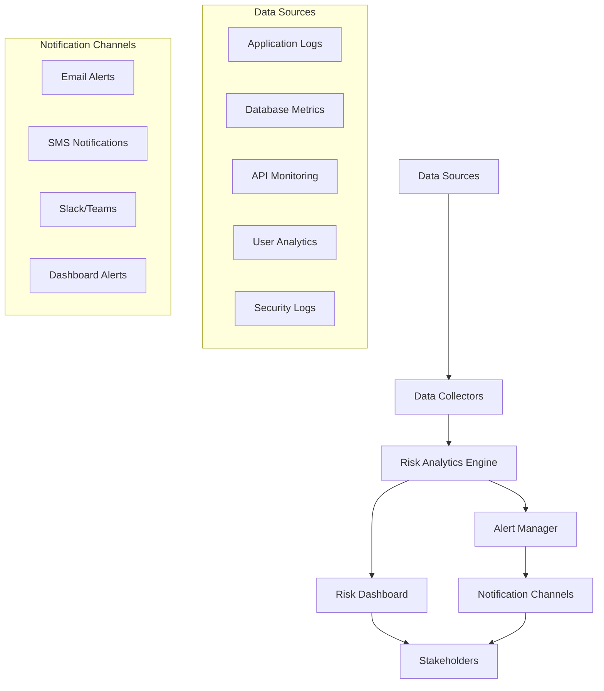

# Risk Monitoring and Alerting System Implementation Guide

## Overview

This document provides implementation guidelines for establishing a comprehensive risk monitoring and alerting system for the Anwar Sales Management System. The system will provide real-time visibility into risk indicators and automated alerting for proactive risk management.

## Risk Monitoring Architecture

### 1. Monitoring Components



### 2. Key Risk Indicators (KRIs) Framework

#### Technical KRIs

| KRI Category             | Metric                | Threshold      | Alert Level | Monitoring Frequency |
| ------------------------ | --------------------- | -------------- | ----------- | -------------------- |
| **API Performance**      | Response Time         | >500ms average | Warning     | Real-time            |
|                          | Error Rate            | >5%            | Critical    | Real-time            |
|                          | Quota Usage           | >80%           | Warning     | Hourly               |
|                          | Quota Usage           | >95%           | Critical    | Real-time            |
| **Database Performance** | Query Response Time   | >1000ms        | Warning     | Real-time            |
|                          | Connection Pool Usage | >80%           | Warning     | Real-time            |
|                          | Disk Usage            | >85%           | Warning     | Hourly               |
|                          | Disk Usage            | >95%           | Critical    | Real-time            |
| **System Resources**     | CPU Usage             | >80%           | Warning     | 5 minutes            |
|                          | Memory Usage          | >85%           | Warning     | 5 minutes            |
|                          | Network Latency       | >200ms         | Warning     | Real-time            |

#### Business KRIs

| KRI Category            | Metric                | Threshold          | Alert Level | Monitoring Frequency |
| ----------------------- | --------------------- | ------------------ | ----------- | -------------------- |
| **User Adoption**       | Daily Active Users    | <70% expected      | Warning     | Daily                |
|                         | Form Completion Rate  | <80%               | Warning     | Daily                |
|                         | User Session Duration | <5 minutes average | Warning     | Daily                |
| **Process Efficiency**  | Form Processing Time  | >2 hours           | Warning     | Hourly               |
|                         | Approval Cycle Time   | >24 hours          | Warning     | Daily                |
|                         | Data Accuracy Rate    | <95%               | Critical    | Daily                |
| **Business Continuity** | System Availability   | <99.5%             | Warning     | Real-time            |
|                         | Backup Success Rate   | <100%              | Critical    | Daily                |

#### Security KRIs

| KRI Category       | Metric                        | Threshold             | Alert Level | Monitoring Frequency |
| ------------------ | ----------------------------- | --------------------- | ----------- | -------------------- |
| **Access Control** | Failed Login Attempts         | >10/hour/user         | Warning     | Real-time            |
|                    | Unauthorized Access Attempts  | >0                    | Critical    | Real-time            |
|                    | Privilege Escalation Attempts | >0                    | Critical    | Real-time            |
| **Data Security**  | Data Export Volume            | >1000 records/day     | Warning     | Daily                |
|                    | Unusual Data Access Patterns  | Anomaly detected      | Warning     | Real-time            |
|                    | Security Scan Results         | Vulnerabilities found | Critical    | Weekly               |

## Implementation Plan

### Phase 1: Foundation Setup (Week 1-2)

#### 1.1 Monitoring Infrastructure

**Tools and Technologies:**

- **Monitoring Platform**: Prometheus + Grafana (Open source) or DataDog (Commercial)
- **Log Aggregation**: ELK Stack (Elasticsearch, Logstash, Kibana)
- **Alert Manager**: Prometheus AlertManager or PagerDuty
- **Notification Services**: Email (SMTP), SMS (Twilio), Slack/Teams webhooks

**Infrastructure Components:**

```yaml
# docker-compose.yml for monitoring stack
version: "3.8"
services:
  prometheus:
    image: prom/prometheus:latest
    ports:
      - "9090:9090"
    volumes:
      - ./prometheus.yml:/etc/prometheus/prometheus.yml
      - prometheus_data:/prometheus
    command:
      - "--config.file=/etc/prometheus/prometheus.yml"
      - "--storage.tsdb.path=/prometheus"
      - "--web.console.libraries=/etc/prometheus/console_libraries"
      - "--web.console.templates=/etc/prometheus/consoles"
      - "--storage.tsdb.retention.time=200h"
      - "--web.enable-lifecycle"

  grafana:
    image: grafana/grafana:latest
    ports:
      - "3000:3000"
    environment:
      - GF_SECURITY_ADMIN_PASSWORD=admin
    volumes:
      - grafana_data:/var/lib/grafana
      - ./grafana/provisioning:/etc/grafana/provisioning

  alertmanager:
    image: prom/alertmanager:latest
    ports:
      - "9093:9093"
    volumes:
      - ./alertmanager.yml:/etc/alertmanager/alertmanager.yml

volumes:
  prometheus_data:
  grafana_data:
```

#### 1.2 Data Collection Setup

**Application Instrumentation:**

```javascript
// Example: Node.js application monitoring
const prometheus = require("prom-client");

// Create metrics
const httpRequestDuration = new prometheus.Histogram({
  name: "http_request_duration_seconds",
  help: "Duration of HTTP requests in seconds",
  labelNames: ["method", "route", "status"],
});

const apiCallsTotal = new prometheus.Counter({
  name: "api_calls_total",
  help: "Total number of API calls",
  labelNames: ["endpoint", "status"],
});

const databaseQueryDuration = new prometheus.Histogram({
  name: "database_query_duration_seconds",
  help: "Duration of database queries in seconds",
  labelNames: ["query_type", "table"],
});

// Middleware for HTTP request monitoring
function monitoringMiddleware(req, res, next) {
  const start = Date.now();

  res.on("finish", () => {
    const duration = (Date.now() - start) / 1000;
    httpRequestDuration
      .labels(req.method, req.route?.path || req.path, res.statusCode)
      .observe(duration);
  });

  next();
}
```

### Phase 2: Alert Configuration (Week 2-3)

#### 2.1 Alert Rules Configuration

**Prometheus Alert Rules:**

```yaml
# alerts.yml
groups:
  - name: anwar_sales_system_alerts
    rules:
      # High API Error Rate
      - alert: HighAPIErrorRate
        expr: rate(api_calls_total{status=~"5.."}[5m]) > 0.05
        for: 2m
        labels:
          severity: critical
          category: technical
        annotations:
          summary: "High API error rate detected"
          description: "API error rate is {{ $value | humanizePercentage }} for the last 5 minutes"

      # Database Performance Degradation
      - alert: SlowDatabaseQueries
        expr: histogram_quantile(0.95, database_query_duration_seconds) > 1.0
        for: 5m
        labels:
          severity: warning
          category: technical
        annotations:
          summary: "Slow database queries detected"
          description: "95th percentile query time is {{ $value }}s"

      # Low User Adoption
      - alert: LowUserAdoption
        expr: daily_active_users / expected_daily_users < 0.7
        for: 1h
        labels:
          severity: warning
          category: business
        annotations:
          summary: "Low user adoption rate"
          description: "Daily active users is {{ $value | humanizePercentage }} of expected"

      # Security: Multiple Failed Logins
      - alert: MultipleFailedLogins
        expr: increase(failed_login_attempts_total[1h]) > 10
        for: 0m
        labels:
          severity: warning
          category: security
        annotations:
          summary: "Multiple failed login attempts"
          description: "{{ $value }} failed login attempts in the last hour"
```

#### 2.2 Notification Configuration

**AlertManager Configuration:**

```yaml
# alertmanager.yml
global:
  smtp_smarthost: "smtp.gmail.com:587"
  smtp_from: "alerts@anwarsales.com"
  smtp_auth_username: "alerts@anwarsales.com"
  smtp_auth_password: "app_password"

route:
  group_by: ["alertname", "category"]
  group_wait: 10s
  group_interval: 10s
  repeat_interval: 1h
  receiver: "default"
  routes:
    - match:
        severity: critical
      receiver: "critical-alerts"
    - match:
        category: security
      receiver: "security-team"
    - match:
        category: business
      receiver: "business-team"

receivers:
  - name: "default"
    email_configs:
      - to: "team@anwarsales.com"
        subject: "[ALERT] {{ .GroupLabels.alertname }}"
        body: |
          {{ range .Alerts }}
          Alert: {{ .Annotations.summary }}
          Description: {{ .Annotations.description }}
          {{ end }}

  - name: "critical-alerts"
    email_configs:
      - to: "critical@anwarsales.com"
        subject: "[CRITICAL] {{ .GroupLabels.alertname }}"
    slack_configs:
      - api_url: "https://hooks.slack.com/services/YOUR/SLACK/WEBHOOK"
        channel: "#critical-alerts"
        title: "Critical Alert: {{ .GroupLabels.alertname }}"
        text: "{{ range .Alerts }}{{ .Annotations.description }}{{ end }}"

  - name: "security-team"
    email_configs:
      - to: "security@anwarsales.com"
        subject: "[SECURITY] {{ .GroupLabels.alertname }}"

  - name: "business-team"
    email_configs:
      - to: "business@anwarsales.com"
        subject: "[BUSINESS] {{ .GroupLabels.alertname }}"
```

### Phase 3: Dashboard Development (Week 3-4)

#### 3.1 Risk Dashboard Design

**Grafana Dashboard Configuration:**

```json
{
  "dashboard": {
    "title": "Anwar Sales System - Risk Monitoring Dashboard",
    "panels": [
      {
        "title": "Risk Score Overview",
        "type": "stat",
        "targets": [
          {
            "expr": "avg(risk_score_total)",
            "legendFormat": "Average Risk Score"
          }
        ],
        "fieldConfig": {
          "defaults": {
            "thresholds": {
              "steps": [
                { "color": "green", "value": 0 },
                { "color": "yellow", "value": 5 },
                { "color": "red", "value": 9 }
              ]
            }
          }
        }
      },
      {
        "title": "API Performance Metrics",
        "type": "graph",
        "targets": [
          {
            "expr": "histogram_quantile(0.95, http_request_duration_seconds)",
            "legendFormat": "95th Percentile Response Time"
          },
          {
            "expr": "rate(api_calls_total{status=~\"5..\"}[5m])",
            "legendFormat": "Error Rate"
          }
        ]
      },
      {
        "title": "User Adoption Metrics",
        "type": "graph",
        "targets": [
          {
            "expr": "daily_active_users",
            "legendFormat": "Daily Active Users"
          },
          {
            "expr": "form_completion_rate",
            "legendFormat": "Form Completion Rate"
          }
        ]
      },
      {
        "title": "Security Metrics",
        "type": "graph",
        "targets": [
          {
            "expr": "increase(failed_login_attempts_total[1h])",
            "legendFormat": "Failed Login Attempts (Hourly)"
          },
          {
            "expr": "security_scan_vulnerabilities",
            "legendFormat": "Security Vulnerabilities"
          }
        ]
      }
    ]
  }
}
```

#### 3.2 Risk Heatmap Implementation

**Risk Heatmap Component:**

```javascript
// Risk heatmap visualization
class RiskHeatmap {
  constructor(containerId) {
    this.container = d3.select(`#${containerId}`);
    this.width = 800;
    this.height = 600;
    this.margin = { top: 50, right: 50, bottom: 50, left: 100 };
  }

  render(riskData) {
    const svg = this.container
      .append("svg")
      .attr("width", this.width)
      .attr("height", this.height);

    const colorScale = d3.scaleSequential(d3.interpolateReds).domain([1, 16]); // Risk score range

    const xScale = d3
      .scaleBand()
      .domain(["Low", "Medium", "High", "Critical"])
      .range([this.margin.left, this.width - this.margin.right])
      .padding(0.1);

    const yScale = d3
      .scaleBand()
      .domain(["Technical", "Business", "Security", "Compliance"])
      .range([this.margin.top, this.height - this.margin.bottom])
      .padding(0.1);

    // Create heatmap cells
    svg
      .selectAll(".risk-cell")
      .data(riskData)
      .enter()
      .append("rect")
      .attr("class", "risk-cell")
      .attr("x", (d) => xScale(d.impact))
      .attr("y", (d) => yScale(d.category))
      .attr("width", xScale.bandwidth())
      .attr("height", yScale.bandwidth())
      .attr("fill", (d) => colorScale(d.riskScore))
      .on("mouseover", this.showTooltip)
      .on("mouseout", this.hideTooltip);

    // Add labels
    svg
      .append("g")
      .attr("transform", `translate(0, ${this.height - this.margin.bottom})`)
      .call(d3.axisBottom(xScale));

    svg
      .append("g")
      .attr("transform", `translate(${this.margin.left}, 0)`)
      .call(d3.axisLeft(yScale));
  }

  showTooltip(event, d) {
    // Tooltip implementation
    const tooltip = d3
      .select("body")
      .append("div")
      .attr("class", "tooltip")
      .style("opacity", 0);

    tooltip.transition().duration(200).style("opacity", 0.9);

    tooltip
      .html(
        `
        <strong>${d.riskTitle}</strong><br/>
        Category: ${d.category}<br/>
        Risk Score: ${d.riskScore}<br/>
        Status: ${d.status}
      `
      )
      .style("left", event.pageX + 10 + "px")
      .style("top", event.pageY - 28 + "px");
  }

  hideTooltip() {
    d3.selectAll(".tooltip").remove();
  }
}
```

## Automated Risk Assessment

### 1. Risk Score Calculation Engine

```python
# risk_calculator.py
import pandas as pd
import numpy as np
from datetime import datetime, timedelta

class RiskCalculator:
    def __init__(self):
        self.risk_weights = {
            'technical': 1.2,
            'business': 1.0,
            'security': 1.5,
            'compliance': 1.3
        }

    def calculate_dynamic_risk_score(self, base_risk, current_metrics):
        """
        Calculate dynamic risk score based on current system metrics
        """
        # Base risk score from risk register
        base_score = base_risk['probability'] * base_risk['impact']

        # Dynamic adjustments based on current metrics
        adjustments = {
            'api_error_rate': self._calculate_api_risk_adjustment(current_metrics.get('api_error_rate', 0)),
            'system_load': self._calculate_load_risk_adjustment(current_metrics.get('cpu_usage', 0)),
            'user_adoption': self._calculate_adoption_risk_adjustment(current_metrics.get('adoption_rate', 1)),
            'security_events': self._calculate_security_risk_adjustment(current_metrics.get('security_events', 0))
        }

        # Apply category weight
        category_weight = self.risk_weights.get(base_risk['category'].lower(), 1.0)

        # Calculate final score
        adjustment_factor = 1 + sum(adjustments.values())
        final_score = base_score * category_weight * adjustment_factor

        return min(final_score, 16)  # Cap at maximum score

    def _calculate_api_risk_adjustment(self, error_rate):
        """Increase risk based on API error rate"""
        if error_rate > 0.1:  # 10% error rate
            return 0.5
        elif error_rate > 0.05:  # 5% error rate
            return 0.3
        elif error_rate > 0.02:  # 2% error rate
            return 0.1
        return 0

    def _calculate_load_risk_adjustment(self, cpu_usage):
        """Increase risk based on system load"""
        if cpu_usage > 0.9:  # 90% CPU usage
            return 0.4
        elif cpu_usage > 0.8:  # 80% CPU usage
            return 0.2
        elif cpu_usage > 0.7:  # 70% CPU usage
            return 0.1
        return 0

    def _calculate_adoption_risk_adjustment(self, adoption_rate):
        """Increase risk based on low user adoption"""
        if adoption_rate < 0.5:  # 50% adoption
            return 0.5
        elif adoption_rate < 0.7:  # 70% adoption
            return 0.3
        elif adoption_rate < 0.8:  # 80% adoption
            return 0.1
        return 0

    def _calculate_security_risk_adjustment(self, security_events):
        """Increase risk based on security events"""
        if security_events > 10:
            return 0.6
        elif security_events > 5:
            return 0.3
        elif security_events > 0:
            return 0.1
        return 0

# Usage example
risk_calc = RiskCalculator()

base_risk = {
    'probability': 2,
    'impact': 3,
    'category': 'Technical'
}

current_metrics = {
    'api_error_rate': 0.03,
    'cpu_usage': 0.75,
    'adoption_rate': 0.65,
    'security_events': 2
}

dynamic_score = risk_calc.calculate_dynamic_risk_score(base_risk, current_metrics)
print(f"Dynamic Risk Score: {dynamic_score:.2f}")
```

### 2. Automated Risk Reporting

```python
# risk_reporter.py
import smtplib
from email.mime.text import MIMEText
from email.mime.multipart import MIMEMultipart
from jinja2 import Template
import json
from datetime import datetime

class RiskReporter:
    def __init__(self, smtp_config):
        self.smtp_config = smtp_config
        self.report_template = self._load_report_template()

    def generate_daily_risk_report(self, risk_data, metrics_data):
        """
        Generate and send daily risk report
        """
        report_data = {
            'date': datetime.now().strftime('%Y-%m-%d'),
            'total_risks': len(risk_data),
            'high_priority_risks': len([r for r in risk_data if r['priority'] == 'High']),
            'new_risks': len([r for r in risk_data if r['date_identified'] == datetime.now().date()]),
            'risks_by_category': self._group_risks_by_category(risk_data),
            'key_metrics': metrics_data,
            'risk_trends': self._calculate_risk_trends(risk_data),
            'recommendations': self._generate_recommendations(risk_data, metrics_data)
        }

        html_report = self.report_template.render(report_data)

        # Send email report
        self._send_email_report(html_report, report_data['date'])

        # Save report to file
        self._save_report_to_file(html_report, report_data['date'])

        return report_data

    def _load_report_template(self):
        template_str = """
        <!DOCTYPE html>
        <html>
        <head>
            <title>Daily Risk Report - {{ date }}</title>
            <style>
                body { font-family: Arial, sans-serif; margin: 20px; }
                .header { background-color: #f0f0f0; padding: 20px; border-radius: 5px; }
                .metric { display: inline-block; margin: 10px; padding: 15px; background-color: #e8f4f8; border-radius: 5px; }
                .risk-table { width: 100%; border-collapse: collapse; margin: 20px 0; }
                .risk-table th, .risk-table td { border: 1px solid #ddd; padding: 8px; text-align: left; }
                .risk-table th { background-color: #f2f2f2; }
                .high-priority { background-color: #ffebee; }
                .medium-priority { background-color: #fff3e0; }
                .low-priority { background-color: #e8f5e8; }
            </style>
        </head>
        <body>
            <div class="header">
                <h1>Daily Risk Report</h1>
                <p>Date: {{ date }}</p>
            </div>

            <h2>Risk Summary</h2>
            <div class="metric">
                <h3>{{ total_risks }}</h3>
                <p>Total Active Risks</p>
            </div>
            <div class="metric">
                <h3>{{ high_priority_risks }}</h3>
                <p>High Priority Risks</p>
            </div>
            <div class="metric">
                <h3>{{ new_risks }}</h3>
                <p>New Risks Today</p>
            </div>

            <h2>Risks by Category</h2>
            <table class="risk-table">
                <tr>
                    <th>Category</th>
                    <th>Count</th>
                    <th>Average Score</th>
                    <th>Highest Priority</th>
                </tr>
                
                <tr>
                    <td>{{ category }}</td>
                    <td>{{ data.count }}</td>
                    <td>{{ data.avg_score }}</td>
                    <td>{{ data.highest_priority }}</td>
                </tr>
                
            </table>

            <h2>Key Metrics</h2>
            <ul>
                
                <li><strong>{{ metric }}:</strong> {{ value }}</li>
                
            </ul>

            <h2>Recommendations</h2>
            <ul>
                
                <li>{{ recommendation }}</li>
                
            </ul>
        </body>
        </html>
        """
        return Template(template_str)

    def _send_email_report(self, html_content, date):
        msg = MIMEMultipart('alternative')
        msg['Subject'] = f'Daily Risk Report - {date}'
        msg['From'] = self.smtp_config['from_email']
        msg['To'] = ', '.join(self.smtp_config['to_emails'])

        html_part = MIMEText(html_content, 'html')
        msg.attach(html_part)

        with smtplib.SMTP(self.smtp_config['smtp_server'], self.smtp_config['smtp_port']) as server:
            server.starttls()
            server.login(self.smtp_config['username'], self.smtp_config['password'])
            server.send_message(msg)
```

## Implementation Checklist

### Week 1: Infrastructure Setup

- [ ] Set up monitoring infrastructure (Prometheus, Grafana)
- [ ] Configure log aggregation (ELK Stack)
- [ ] Install and configure AlertManager
- [ ] Set up notification channels (Email, Slack, SMS)
- [ ] Create monitoring user accounts and permissions

### Week 2: Metrics Collection

- [ ] Instrument application code with metrics
- [ ] Configure database monitoring
- [ ] Set up API monitoring and logging
- [ ] Implement user analytics tracking
- [ ] Configure security event logging

### Week 3: Alert Configuration

- [ ] Define alert rules for all KRIs
- [ ] Configure notification routing
- [ ] Test alert delivery mechanisms
- [ ] Set up escalation procedures
- [ ] Create alert documentation

### Week 4: Dashboard and Reporting

- [ ] Create risk monitoring dashboards
- [ ] Implement risk heatmap visualization
- [ ] Set up automated reporting
- [ ] Configure dashboard access controls
- [ ] Train team on dashboard usage

## Success Metrics

### Monitoring System KPIs

- **Alert Accuracy**: >95% of alerts are actionable
- **Response Time**: <5 minutes for critical alerts
- **Coverage**: 100% of identified KRIs are monitored
- **Availability**: 99.9% monitoring system uptime
- **User Adoption**: >90% of stakeholders use dashboards weekly

### Risk Management Effectiveness

- **Risk Detection**: 100% of materialized risks were previously identified
- **Mitigation Success**: >80% of risks reduced to acceptable levels
- **Incident Reduction**: 50% reduction in unplanned incidents
- **Stakeholder Satisfaction**: >4.0/5.0 rating for risk communication

## Maintenance and Updates

### Regular Maintenance Tasks

- **Daily**: Review alert logs and false positives
- **Weekly**: Update risk thresholds based on trends
- **Monthly**: Review and update KRI definitions
- **Quarterly**: Comprehensive system health check
- **Annually**: Full monitoring system review and upgrade

### Continuous Improvement

- Collect feedback from stakeholders on alert relevance
- Analyze alert patterns to identify system improvements
- Regular review of monitoring coverage gaps
- Update dashboards based on user needs
- Benchmark against industry best practices

---

_This monitoring system implementation guide should be reviewed and updated regularly to ensure continued effectiveness in risk management._
