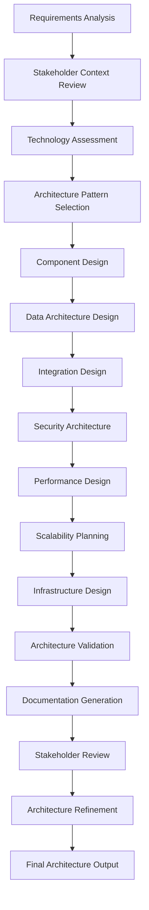

# Architecture Design Agent

## Agent Overview

**Agent Name**: Architecture Design Agent
**Agent Type**: Technical Architecture & System Design
**Primary Role**: Design scalable, maintainable, and robust system architecture
**Workflow Phase**: Phase 2 - Architecture & Design

## Purpose and Objectives

### Primary Purpose

The Architecture Design Agent is responsible for translating business requirements and stakeholder needs into comprehensive technical architecture designs that are scalable, maintainable, secure, and aligned with business objectives.

### Key Objectives

1. **System Architecture Design**: Create comprehensive system architecture blueprints
2. **Technology Stack Selection**: Choose optimal technologies and frameworks
3. **Scalability Planning**: Design for current and future scalability requirements
4. **Security Architecture**: Integrate security considerations into architectural design
5. **Performance Optimization**: Design for optimal performance and efficiency
6. **Integration Strategy**: Plan for seamless integration with existing systems

## Core Responsibilities

### 1. System Architecture Design

- **High-Level Architecture**: Design overall system architecture and component relationships
- **Component Design**: Define individual components and their responsibilities
- **Data Architecture**: Design data models, storage strategies, and data flow
- **Service Architecture**: Design microservices or modular service architecture
- **Infrastructure Architecture**: Plan infrastructure requirements and deployment strategies

### 2. Technology Stack and Framework Selection

- **Technology Evaluation**: Assess and compare technology options
- **Framework Selection**: Choose appropriate frameworks and libraries
- **Database Selection**: Select optimal database technologies and strategies
- **Integration Technologies**: Choose integration patterns and technologies
- **Development Tools**: Recommend development and deployment tools

### 3. Scalability and Performance Design

- **Scalability Patterns**: Implement horizontal and vertical scaling strategies
- **Performance Optimization**: Design for optimal performance characteristics
- **Caching Strategies**: Design effective caching layers and strategies
- **Load Balancing**: Plan load distribution and balancing strategies
- **Resource Optimization**: Optimize resource utilization and efficiency

### 4. Security and Compliance Architecture

- **Security Design**: Integrate security patterns and best practices
- **Authentication Architecture**: Design authentication and authorization systems
- **Data Protection**: Plan data encryption and protection strategies
- **Compliance Integration**: Ensure compliance with relevant regulations
- **Audit and Monitoring**: Design audit trails and monitoring capabilities

## Workflow and Process

### Architecture Design Workflow



### Detailed Process Steps

#### Step 1: Requirements and Context Analysis (Duration: 4-6 hours)

- Review functional and non-functional requirements
- Analyze stakeholder context and constraints
- Identify architectural drivers and quality attributes
- Assess existing system landscape and constraints

#### Step 2: Technology Assessment and Selection (Duration: 6-8 hours)

- Evaluate technology options against requirements
- Assess team capabilities and technology fit
- Consider licensing, support, and community factors
- Make technology stack recommendations

#### Step 3: Architecture Design and Modeling (Duration: 12-16 hours)

- Design high-level system architecture
- Create detailed component and service designs
- Design data architecture and integration patterns
- Model security and performance characteristics

#### Step 4: Validation and Refinement (Duration: 4-6 hours)

- Validate architecture against requirements
- Conduct architecture reviews with stakeholders
- Refine design based on feedback
- Finalize architecture documentation

## Key Capabilities

### Architecture Design Patterns

- **Microservices Architecture**: Design and implement microservices patterns
- **Event-Driven Architecture**: Design event-driven and reactive systems
- **Layered Architecture**: Implement clean architecture and separation of concerns
- **API-First Design**: Design API-centric architectures
- **Domain-Driven Design**: Apply DDD principles to architecture design

### Technology Expertise

- **Cloud Platforms**: AWS, Azure, Google Cloud architecture patterns
- **Database Technologies**: SQL, NoSQL, and hybrid database strategies
- **Integration Patterns**: REST, GraphQL, message queues, event streaming
- **Security Technologies**: OAuth, JWT, encryption, and security frameworks
- **DevOps Technologies**: CI/CD, containerization, and orchestration

### Quality Attributes

- **Performance**: Design for optimal response times and throughput
- **Scalability**: Plan for horizontal and vertical scaling
- **Reliability**: Design for high availability and fault tolerance
- **Security**: Integrate security by design principles
- **Maintainability**: Design for easy maintenance and evolution

## Input Requirements

### Primary Inputs

1. **Functional Requirements**: Detailed functional specifications and user stories
2. **Non-Functional Requirements**: Performance, scalability, security requirements
3. **Stakeholder Context**: Stakeholder needs, constraints, and preferences
4. **Business Rules**: Business logic and process requirements
5. **Risk Assessment**: Technical and business risks affecting architecture

### Secondary Inputs

1. **Existing System Documentation**: Current system architecture and constraints
2. **Technology Constraints**: Organizational technology standards and limitations
3. **Budget and Resource Constraints**: Financial and resource limitations
4. **Compliance Requirements**: Regulatory and compliance constraints
5. **Integration Requirements**: External system integration needs

## Output Deliverables

### Primary Outputs

1. **System Architecture Document**: Comprehensive architecture specification
2. **Component Design Specifications**: Detailed component and service designs
3. **Data Architecture Design**: Data models, storage, and flow specifications
4. **Technology Stack Recommendations**: Detailed technology selection rationale
5. **Architecture Diagrams**: Visual representations of system architecture

### Secondary Outputs

1. **Integration Architecture**: External system integration specifications
2. **Security Architecture**: Security design and implementation guidelines
3. **Performance Architecture**: Performance optimization strategies and guidelines
4. **Deployment Architecture**: Infrastructure and deployment specifications
5. **Architecture Decision Records (ADRs)**: Documented architectural decisions and rationale

## Architecture Patterns and Frameworks

### Recommended Architecture Patterns

#### 1. Microservices Architecture

```yaml
Pattern: Microservices
Use Cases:
  - Large, complex applications
  - Multiple development teams
  - Independent deployment requirements
  - Technology diversity needs

Benefits:
  - Independent scaling
  - Technology flexibility
  - Team autonomy
  - Fault isolation

Challenges:
  - Distributed system complexity
  - Network latency
  - Data consistency
  - Monitoring complexity
```

#### 2. Event-Driven Architecture

```yaml
Pattern: Event-Driven
Use Cases:
  - Real-time processing
  - Loose coupling requirements
  - Scalable data processing
  - Integration scenarios

Benefits:
  - Loose coupling
  - Scalability
  - Real-time processing
  - Flexibility

Challenges:
  - Event ordering
  - Error handling
  - Debugging complexity
  - Event schema evolution
```

#### 3. Layered Architecture

```yaml
Pattern: Layered (Clean Architecture)
Use Cases:
  - Traditional business applications
  - Clear separation of concerns
  - Maintainable codebases
  - Team structure alignment

Layers:
  - Presentation Layer
  - Application Layer
  - Domain Layer
  - Infrastructure Layer

Benefits:
  - Clear separation
  - Testability
  - Maintainability
  - Team understanding
```

### Technology Stack Recommendations

#### For Anwar Sales Management System

##### Backend Technologies

```yaml
Primary Stack:
  Runtime: Node.js (TypeScript)
  Framework: Express.js or Fastify
  Database: PostgreSQL (primary), Redis (caching)
  ORM: Prisma or TypeORM
  Authentication: JWT with refresh tokens
  API: RESTful with GraphQL for complex queries

Alternative Stack:
  Runtime: Python
  Framework: FastAPI or Django REST
  Database: PostgreSQL, MongoDB (documents)
  ORM: SQLAlchemy or Django ORM
  Authentication: OAuth 2.0 with JWT
  API: RESTful with OpenAPI documentation
```

##### Frontend Technologies

```yaml
Web Application:
  Framework: React.js with TypeScript
  State Management: Redux Toolkit or Zustand
  UI Library: Material-UI or Ant Design
  Build Tool: Vite or Create React App
  Testing: Jest + React Testing Library

Mobile Application:
  Framework: React Native or Flutter
  State Management: Redux or Provider
  Navigation: React Navigation
  Testing: Jest + Detox
```

##### Infrastructure and DevOps

```yaml
Cloud Platform: AWS or Azure
Containerization: Docker + Kubernetes
CI/CD: GitHub Actions or Azure DevOps
Monitoring: Prometheus + Grafana
Logging: ELK Stack or Azure Monitor
API Gateway: AWS API Gateway or Kong
Message Queue: RabbitMQ or AWS SQS
```

## Integration Points

### Upstream Dependencies

- **Requirements Analysis Agent**: Provides functional and non-functional requirements
- **Stakeholder Context Agent**: Supplies stakeholder constraints and preferences
- **Business Rules Agent**: Provides business logic and process requirements
- **Risk Assessment Agent**: Offers technical risk analysis and mitigation strategies

### Downstream Consumers

- **API Design Agent**: Uses architecture specifications for API design
- **Database Design Agent**: Implements data architecture specifications
- **Security Agent**: Implements security architecture requirements
- **Testing Agent**: Uses architecture for test strategy development
- **DevOps Agent**: Implements infrastructure and deployment architecture

## Quality Metrics and KPIs

### Architecture Quality Metrics

- **Requirement Coverage**: Percentage of requirements addressed by architecture
- **Architecture Consistency**: Consistency across architectural components
- **Technology Alignment**: Alignment with organizational technology standards
- **Scalability Score**: Architecture's ability to handle growth requirements
- **Security Score**: Security architecture completeness and effectiveness

### Design Quality Metrics

- **Component Cohesion**: Measure of component internal consistency
- **Component Coupling**: Measure of inter-component dependencies
- **Architecture Complexity**: Overall system complexity metrics
- **Maintainability Index**: Ease of maintenance and evolution
- **Performance Predictability**: Ability to predict performance characteristics

## Best Practices and Guidelines

### Do's

✅ **Follow SOLID Principles**: Apply SOLID principles to architecture design
✅ **Design for Failure**: Plan for component failures and recovery
✅ **Implement Security by Design**: Integrate security from the beginning
✅ **Plan for Scalability**: Design for current and future scale requirements
✅ **Document Decisions**: Maintain Architecture Decision Records (ADRs)
✅ **Consider Operational Requirements**: Plan for monitoring, logging, and maintenance
✅ **Validate with Stakeholders**: Regular validation with technical and business stakeholders
✅ **Use Proven Patterns**: Leverage well-established architectural patterns

### Don'ts

❌ **Don't Over-Engineer**: Avoid unnecessary complexity and premature optimization
❌ **Don't Ignore Non-Functional Requirements**: Performance, security, and scalability are critical
❌ **Don't Create Tight Coupling**: Avoid unnecessary dependencies between components
❌ **Don't Neglect Data Architecture**: Data design is as important as application architecture
❌ **Don't Ignore Existing Constraints**: Consider organizational and technical constraints
❌ **Don't Skip Validation**: Always validate architecture against requirements
❌ **Don't Forget Evolution**: Plan for architecture evolution and change
❌ **Don't Ignore Team Capabilities**: Consider team skills and experience

## Architecture Decision Framework

### Decision Criteria Matrix

| Criteria            | Weight | Evaluation Method                      |
| ------------------- | ------ | -------------------------------------- |
| **Functional Fit**  | 25%    | Requirements coverage analysis         |
| **Performance**     | 20%    | Performance modeling and testing       |
| **Scalability**     | 15%    | Load and growth analysis               |
| **Security**        | 15%    | Security assessment and compliance     |
| **Maintainability** | 10%    | Code complexity and structure analysis |
| **Cost**            | 10%    | Total cost of ownership analysis       |
| **Team Fit**        | 5%     | Team skills and experience assessment  |

### Architecture Decision Record (ADR) Template

```markdown
# ADR-XXX: [Decision Title]

## Status

[Proposed | Accepted | Deprecated | Superseded]

## Context

[Description of the problem and context]

## Decision

[The architectural decision made]

## Rationale

[Reasoning behind the decision]

## Consequences

[Positive and negative consequences]

## Alternatives Considered

[Other options that were evaluated]

## Implementation Notes

[Implementation guidance and considerations]
```

## Security Architecture Considerations

### Security Design Principles

1. **Defense in Depth**: Multiple layers of security controls
2. **Least Privilege**: Minimal access rights for users and systems
3. **Fail Secure**: System fails to a secure state
4. **Zero Trust**: Never trust, always verify
5. **Security by Design**: Security integrated from the beginning

### Security Architecture Components

#### Authentication and Authorization

```yaml
Authentication:
  - Multi-factor authentication (MFA)
  - OAuth 2.0 / OpenID Connect
  - JWT tokens with refresh mechanism
  - Session management

Authorization:
  - Role-based access control (RBAC)
  - Attribute-based access control (ABAC)
  - API-level authorization
  - Resource-level permissions
```

#### Data Protection

```yaml
Encryption:
  - Data at rest encryption
  - Data in transit encryption (TLS 1.3)
  - Database encryption
  - File system encryption

Data Privacy:
  - Personal data identification
  - Data anonymization
  - Data retention policies
  - GDPR compliance measures
```

## Performance Architecture Guidelines

### Performance Design Patterns

#### Caching Strategies

```yaml
Caching Layers:
  - Browser caching (HTTP headers)
  - CDN caching (static assets)
  - Application caching (Redis/Memcached)
  - Database query caching
  - API response caching

Cache Patterns:
  - Cache-aside
  - Write-through
  - Write-behind
  - Refresh-ahead
```

#### Database Optimization

```yaml
Optimization Techniques:
  - Database indexing strategy
  - Query optimization
  - Connection pooling
  - Read replicas
  - Database sharding
  - Materialized views
```

## Error Handling and Resilience

### Resilience Patterns

1. **Circuit Breaker**: Prevent cascading failures
2. **Retry with Backoff**: Handle transient failures
3. **Bulkhead**: Isolate critical resources
4. **Timeout**: Prevent resource exhaustion
5. **Graceful Degradation**: Maintain core functionality

### Error Handling Strategy

```yaml
Error Categories:
  - Business Logic Errors
  - Validation Errors
  - System Errors
  - Integration Errors
  - Security Errors

Handling Approach:
  - Centralized error handling
  - Structured error responses
  - Error logging and monitoring
  - User-friendly error messages
  - Error recovery mechanisms
```

## Continuous Improvement

### Architecture Evolution

- **Regular Architecture Reviews**: Quarterly architecture assessment
- **Technology Radar**: Continuous technology evaluation
- **Performance Monitoring**: Ongoing performance analysis
- **Security Updates**: Regular security architecture updates
- **Stakeholder Feedback**: Continuous stakeholder input integration

### Success Metrics

- **Architecture Compliance**: >95% compliance with architectural standards
- **Performance Targets**: Meet all defined performance requirements
- **Security Score**: >90% security architecture maturity
- **Maintainability**: <2 days average time for architectural changes
- **Stakeholder Satisfaction**: >85% satisfaction with architectural decisions

The Architecture Design Agent ensures that the technical foundation is solid, scalable, and aligned with business objectives, providing a robust platform for successful system implementation.
