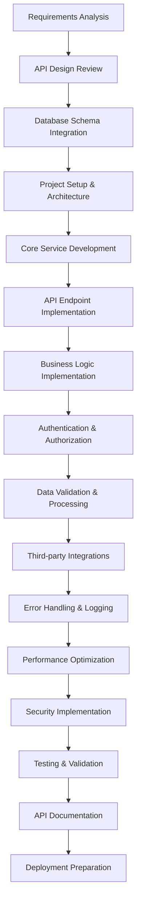

# Backend Development Agent

## Agent Overview

**Agent Name**: Backend Development Agent
**Agent Type**: Server-Side Application Development
**Primary Role**: Build robust, scalable, and secure backend services and APIs
**Workflow Phase**: Phase 3 - Development & Implementation

## Purpose and Objectives

### Primary Purpose

The Backend Development Agent specializes in creating high-performance, secure, and maintainable server-side applications that handle business logic, data processing, API endpoints, and system integrations for the Anwar Sales Management System.

### Key Objectives

1. **API Development**: Create comprehensive RESTful APIs with proper documentation
2. **Business Logic Implementation**: Implement complex business rules and workflows
3. **Data Management**: Handle data validation, processing, and persistence
4. **Security Implementation**: Implement authentication, authorization, and data protection
5. **Performance Optimization**: Ensure optimal response times and scalability
6. **Integration Management**: Handle third-party service integrations and webhooks

## Core Responsibilities

### 1. API Development and Management

- **RESTful API Design**: Create well-structured REST endpoints following OpenAPI standards
- **GraphQL Implementation**: Implement GraphQL APIs for complex data requirements
- **API Documentation**: Generate comprehensive API documentation with examples
- **Versioning Strategy**: Implement API versioning for backward compatibility
- **Rate Limiting**: Implement request throttling and abuse prevention

### 2. Business Logic and Workflow Implementation

- **Domain Logic**: Implement core business rules and domain-specific logic
- **Workflow Orchestration**: Create complex business process workflows
- **Event Processing**: Handle asynchronous events and message processing
- **Validation Logic**: Implement comprehensive data validation and sanitization
- **Business Rule Engine**: Create configurable business rule processing

### 3. Data Layer and Persistence

- **Database Integration**: Implement database operations with ORM/ODM
- **Query Optimization**: Create efficient database queries and indexes
- **Transaction Management**: Handle complex database transactions
- **Data Migration**: Implement database schema migrations and data updates
- **Caching Strategy**: Implement multi-level caching for performance

### 4. Security and Authentication

- **Authentication Systems**: Implement JWT, OAuth, and session-based authentication
- **Authorization Framework**: Create role-based access control (RBAC)
- **Data Encryption**: Implement encryption for sensitive data
- **Security Headers**: Configure security headers and CORS policies
- **Audit Logging**: Implement comprehensive audit trails

## Workflow and Process

### Backend Development Workflow



### Detailed Process Steps

#### Step 1: Setup and Architecture (Duration: 8-12 hours)

- Set up project structure and development environment
- Configure database connections and ORM setup
- Implement basic middleware and security configurations
- Set up logging, monitoring, and error handling

#### Step 2: Core API Development (Duration: 40-60 hours)

- Implement authentication and authorization systems
- Create core CRUD operations for all entities
- Implement business logic and workflow processing
- Add data validation and error handling

#### Step 3: Advanced Features (Duration: 30-40 hours)

- Implement third-party service integrations
- Add real-time features with WebSockets
- Create background job processing
- Implement caching and performance optimizations

#### Step 4: Testing and Documentation (Duration: 20-30 hours)

- Write comprehensive unit and integration tests
- Create API documentation and examples
- Perform security testing and vulnerability assessment
- Conduct performance testing and optimization

## Key Capabilities

### Backend Technologies

- **Runtime Environments**: Node.js, Python, Java, .NET, Go
- **Frameworks**: Express.js, Fastify, Django, Flask, Spring Boot, ASP.NET Core
- **Databases**: PostgreSQL, MySQL, MongoDB, Redis, Elasticsearch
- **Message Queues**: RabbitMQ, Apache Kafka, AWS SQS, Redis Pub/Sub
- **Caching**: Redis, Memcached, Application-level caching

### Development Patterns

- **Architectural Patterns**: Microservices, Monolithic, Serverless, Event-Driven
- **Design Patterns**: Repository, Factory, Observer, Strategy, Command
- **API Patterns**: RESTful, GraphQL, gRPC, WebSocket
- **Security Patterns**: JWT, OAuth 2.0, RBAC, API Gateway
- **Performance Patterns**: Caching, Connection Pooling, Load Balancing

### Integration Capabilities

- **Payment Gateways**: Stripe, PayPal, Square, local payment processors
- **Communication APIs**: Twilio, SendGrid, WhatsApp Business API
- **Cloud Services**: AWS, Azure, Google Cloud Platform
- **Authentication Providers**: Google OAuth, Microsoft Azure AD, Auth0
- **Monitoring Tools**: New Relic, DataDog, Prometheus, Grafana

## Input Requirements

### Primary Inputs

1. **API Specifications**: Detailed API design documents and OpenAPI schemas
2. **Database Schema**: Complete database design and entity relationships
3. **Business Requirements**: Detailed business logic and workflow requirements
4. **Security Requirements**: Authentication, authorization, and data protection needs
5. **Integration Requirements**: Third-party service integration specifications

### Secondary Inputs

1. **Performance Requirements**: Response time, throughput, and scalability needs
2. **Compliance Requirements**: Regulatory and compliance standards
3. **Monitoring Requirements**: Logging, metrics, and alerting specifications
4. **Deployment Requirements**: Infrastructure and deployment specifications
5. **Testing Requirements**: Test coverage and quality assurance standards

## Output Deliverables

### Primary Outputs

1. **Backend Application**: Complete server-side application with all features
2. **API Documentation**: Comprehensive API documentation with examples
3. **Database Migrations**: Schema migration scripts and data seeding
4. **Configuration Files**: Environment-specific configuration files
5. **Deployment Scripts**: Docker files and deployment automation scripts

### Secondary Outputs

1. **Test Suite**: Comprehensive unit, integration, and API tests
2. **Performance Benchmarks**: Performance testing results and optimization recommendations
3. **Security Assessment**: Security audit report and vulnerability assessment
4. **Monitoring Setup**: Logging, metrics, and alerting configuration
5. **Developer Documentation**: Code documentation and development guidelines

## Technology Stack for Anwar Sales Management System

### Recommended Backend Stack

#### Node.js with TypeScript

```yaml
Runtime: Node.js 18+ LTS
Language: TypeScript 5+
Framework: Express.js with Helmet for security
ORM: Prisma or TypeORM
Validation: Zod or Joi
Authentication: Passport.js with JWT
Testing: Jest + Supertest
Documentation: Swagger/OpenAPI 3.0
Logging: Winston with structured logging
Process Management: PM2
```

#### Alternative: Python with FastAPI

```yaml
Runtime: Python 3.11+
Framework: FastAPI with Pydantic
ORM: SQLAlchemy with Alembic
Authentication: FastAPI-Users or custom JWT
Testing: Pytest + httpx
Documentation: Auto-generated OpenAPI
Logging: Structlog
Process Management: Gunicorn + Uvicorn
```

### Project Structure (Node.js/TypeScript)

```
src/
├── controllers/          # Request handlers and route logic
│   ├── auth.controller.ts
│   ├── contractor.controller.ts
│   ├── engineer.controller.ts
│   ├── retailer.controller.ts
│   └── site.controller.ts
├── services/            # Business logic and service layer
│   ├── auth.service.ts
│   ├── contractor.service.ts
│   ├── notification.service.ts
│   └── integration.service.ts
├── models/              # Database models and schemas
│   ├── User.ts
│   ├── Contractor.ts
│   ├── Engineer.ts
│   └── index.ts
├── middleware/          # Custom middleware functions
│   ├── auth.middleware.ts
│   ├── validation.middleware.ts
│   ├── error.middleware.ts
│   └── logging.middleware.ts
├── routes/              # API route definitions
│   ├── auth.routes.ts
│   ├── contractor.routes.ts
│   ├── api.routes.ts
│   └── index.ts
├── utils/               # Utility functions and helpers
│   ├── database.ts
│   ├── encryption.ts
│   ├── validation.ts
│   └── logger.ts
├── config/              # Configuration files
│   ├── database.config.ts
│   ├── auth.config.ts
│   └── app.config.ts
├── types/               # TypeScript type definitions
│   ├── auth.types.ts
│   ├── api.types.ts
│   └── database.types.ts
└── tests/               # Test files
    ├── unit/
    ├── integration/
    └── e2e/
```

## Core Implementation

### 1. Application Setup and Configuration

```typescript
// src/app.ts - Main application setup
import express from "express";
import helmet from "helmet";
import cors from "cors";
import compression from "compression";
import rateLimit from "express-rate-limit";
import { errorHandler } from "./middleware/error.middleware";
import { requestLogger } from "./middleware/logging.middleware";
import { apiRoutes } from "./routes";
import { connectDatabase } from "./utils/database";
import { logger } from "./utils/logger";

class Application {
  public app: express.Application;

  constructor() {
    this.app = express();
    this.initializeMiddleware();
    this.initializeRoutes();
    this.initializeErrorHandling();
  }

  private initializeMiddleware(): void {
    // Security middleware
    this.app.use(helmet());

    // CORS configuration
    this.app.use(
      cors({
        origin: process.env.ALLOWED_ORIGINS?.split(",") || [
          "http://localhost:3000",
        ],
        credentials: true,
        methods: ["GET", "POST", "PUT", "DELETE", "PATCH"],
        allowedHeaders: ["Content-Type", "Authorization"],
      })
    );

    // Rate limiting
    const limiter = rateLimit({
      windowMs: 15 * 60 * 1000, // 15 minutes
      max: 100, // limit each IP to 100 requests per windowMs
      message: "Too many requests from this IP, please try again later.",
      standardHeaders: true,
      legacyHeaders: false,
    });
    this.app.use("/api/", limiter);

    // Body parsing and compression
    this.app.use(express.json({ limit: "10mb" }));
    this.app.use(express.urlencoded({ extended: true, limit: "10mb" }));
    this.app.use(compression());

    // Request logging
    this.app.use(requestLogger);
  }

  private initializeRoutes(): void {
    this.app.use("/api/v1", apiRoutes);

    // Health check endpoint
    this.app.get("/health", (req, res) => {
      res.status(200).json({
        status: "OK",
        timestamp: new Date().toISOString(),
        uptime: process.uptime(),
      });
    });
  }

  private initializeErrorHandling(): void {
    this.app.use(errorHandler);
  }

  public async start(port: number): Promise<void> {
    try {
      await connectDatabase();

      this.app.listen(port, () => {
        logger.info(`Server running on port ${port}`);
      });
    } catch (error) {
      logger.error("Failed to start server:", error);
      process.exit(1);
    }
  }
}

export default Application;
```

### 2. Authentication and Authorization

```typescript
// src/services/auth.service.ts
import bcrypt from "bcryptjs";
import jwt from "jsonwebtoken";
import { User } from "../models/User";
import { AppError } from "../utils/AppError";
import { logger } from "../utils/logger";

interface LoginCredentials {
  email: string;
  password: string;
}

interface AuthTokens {
  accessToken: string;
  refreshToken: string;
}

interface UserPayload {
  id: string;
  email: string;
  role: string;
  territory?: string;
}

export class AuthService {
  private readonly JWT_SECRET = process.env.JWT_SECRET!;
  private readonly JWT_REFRESH_SECRET = process.env.JWT_REFRESH_SECRET!;
  private readonly JWT_EXPIRES_IN = process.env.JWT_EXPIRES_IN || "15m";
  private readonly JWT_REFRESH_EXPIRES_IN =
    process.env.JWT_REFRESH_EXPIRES_IN || "7d";

  async login(
    credentials: LoginCredentials
  ): Promise<{ user: UserPayload; tokens: AuthTokens }> {
    const { email, password } = credentials;

    // Find user by email
    const user = await User.findOne({
      where: { email: email.toLowerCase() },
      select: [
        "id",
        "email",
        "password",
        "firstName",
        "lastName",
        "role",
        "status",
      ],
    });

    if (!user) {
      throw new AppError("Invalid credentials", 401);
    }

    // Check if user is active
    if (user.status !== "active") {
      throw new AppError("Account is not active", 401);
    }

    // Verify password
    const isPasswordValid = await bcrypt.compare(password, user.password);
    if (!isPasswordValid) {
      throw new AppError("Invalid credentials", 401);
    }

    // Update last login
    await User.update(user.id, { lastLoginAt: new Date() });

    // Generate tokens
    const userPayload: UserPayload = {
      id: user.id,
      email: user.email,
      role: user.role,
      territory: user.profile?.territory,
    };

    const tokens = this.generateTokens(userPayload);

    logger.info(`User logged in: ${user.email}`);

    return {
      user: userPayload,
      tokens,
    };
  }

  async register(
    userData: any
  ): Promise<{ user: UserPayload; tokens: AuthTokens }> {
    const { email, password, firstName, lastName, role } = userData;

    // Check if user already exists
    const existingUser = await User.findOne({
      where: { email: email.toLowerCase() },
    });
    if (existingUser) {
      throw new AppError("User already exists with this email", 409);
    }

    // Hash password
    const hashedPassword = await bcrypt.hash(password, 12);

    // Create user
    const user = await User.create({
      email: email.toLowerCase(),
      password: hashedPassword,
      firstName,
      lastName,
      role,
      status: "active",
    });

    const userPayload: UserPayload = {
      id: user.id,
      email: user.email,
      role: user.role,
    };

    const tokens = this.generateTokens(userPayload);

    logger.info(`New user registered: ${user.email}`);

    return {
      user: userPayload,
      tokens,
    };
  }

  async refreshToken(refreshToken: string): Promise<AuthTokens> {
    try {
      const decoded = jwt.verify(refreshToken, this.JWT_REFRESH_SECRET) as any;

      // Verify user still exists and is active
      const user = await User.findOne({
        where: { id: decoded.id, status: "active" },
      });

      if (!user) {
        throw new AppError("Invalid refresh token", 401);
      }

      const userPayload: UserPayload = {
        id: user.id,
        email: user.email,
        role: user.role,
        territory: user.profile?.territory,
      };

      return this.generateTokens(userPayload);
    } catch (error) {
      throw new AppError("Invalid refresh token", 401);
    }
  }

  private generateTokens(payload: UserPayload): AuthTokens {
    const accessToken = jwt.sign(payload, this.JWT_SECRET, {
      expiresIn: this.JWT_EXPIRES_IN,
    });

    const refreshToken = jwt.sign({ id: payload.id }, this.JWT_REFRESH_SECRET, {
      expiresIn: this.JWT_REFRESH_EXPIRES_IN,
    });

    return { accessToken, refreshToken };
  }

  async verifyToken(token: string): Promise<UserPayload> {
    try {
      const decoded = jwt.verify(token, this.JWT_SECRET) as UserPayload;

      // Verify user still exists and is active
      const user = await User.findOne({
        where: { id: decoded.id, status: "active" },
      });

      if (!user) {
        throw new AppError("User not found or inactive", 401);
      }

      return decoded;
    } catch (error) {
      throw new AppError("Invalid token", 401);
    }
  }
}

export const authService = new AuthService();
```

### 3. Contractor Management Service

```typescript
// src/services/contractor.service.ts
import { Contractor } from "../models/Contractor";
import { ContractorAddress } from "../models/ContractorAddress";
import { ContractorDocument } from "../models/ContractorDocument";
import { AppError } from "../utils/AppError";
import { logger } from "../utils/logger";
import { notificationService } from "./notification.service";
import { generateContractorCode } from "../utils/codeGenerator";

interface ContractorCreateData {
  companyName: string;
  contactPerson: string;
  email: string;
  phone: string;
  whatsappNumber?: string;
  licenseNumber?: string;
  licenseExpiryDate?: Date;
  territory: string;
  specializations: string[];
  yearsExperience?: number;
  addresses: {
    addressType: "business" | "mailing" | "site";
    streetAddress: string;
    city: string;
    state: string;
    postalCode: string;
    country?: string;
    isPrimary?: boolean;
  }[];
}

interface ContractorFilters {
  search?: string;
  territory?: string;
  status?: string;
  specializations?: string[];
  page?: number;
  limit?: number;
}

export class ContractorService {
  async createContractor(
    data: ContractorCreateData,
    createdBy: string
  ): Promise<Contractor> {
    try {
      // Generate unique contractor code
      const contractorCode = await generateContractorCode(data.territory);

      // Create contractor
      const contractor = await Contractor.create({
        contractorCode,
        companyName: data.companyName,
        contactPerson: data.contactPerson,
        email: data.email.toLowerCase(),
        phone: data.phone,
        whatsappNumber: data.whatsappNumber,
        licenseNumber: data.licenseNumber,
        licenseExpiryDate: data.licenseExpiryDate,
        territory: data.territory,
        specializations: data.specializations,
        yearsExperience: data.yearsExperience,
        status: "pending",
        createdBy,
      });

      // Create addresses
      if (data.addresses && data.addresses.length > 0) {
        const addresses = data.addresses.map((addr) => ({
          ...addr,
          contractorId: contractor.id,
        }));

        await ContractorAddress.createMany(addresses);
      }

      // Send notifications
      await this.sendRegistrationNotifications(contractor);

      logger.info(`Contractor created: ${contractor.contractorCode}`);

      return contractor;
    } catch (error) {
      logger.error("Error creating contractor:", error);
      throw new AppError("Failed to create contractor", 500);
    }
  }

  async getContractors(
    filters: ContractorFilters
  ): Promise<{ contractors: Contractor[]; total: number }> {
    const {
      search,
      territory,
      status,
      specializations,
      page = 1,
      limit = 10,
    } = filters;

    const queryBuilder = Contractor.createQueryBuilder("contractor")
      .leftJoinAndSelect("contractor.addresses", "address")
      .leftJoinAndSelect("contractor.documents", "document")
      .leftJoinAndSelect("contractor.createdByUser", "createdBy");

    // Apply filters
    if (search) {
      queryBuilder.andWhere(
        "(contractor.companyName ILIKE :search OR contractor.contactPerson ILIKE :search OR contractor.email ILIKE :search)",
        { search: `%${search}%` }
      );
    }

    if (territory) {
      queryBuilder.andWhere("contractor.territory = :territory", { territory });
    }

    if (status) {
      queryBuilder.andWhere("contractor.status = :status", { status });
    }

    if (specializations && specializations.length > 0) {
      queryBuilder.andWhere("contractor.specializations && :specializations", {
        specializations,
      });
    }

    // Get total count
    const total = await queryBuilder.getCount();

    // Apply pagination
    const contractors = await queryBuilder
      .orderBy("contractor.createdAt", "DESC")
      .skip((page - 1) * limit)
      .take(limit)
      .getMany();

    return { contractors, total };
  }

  async getContractorById(id: string): Promise<Contractor> {
    const contractor = await Contractor.findOne({
      where: { id },
      relations: ["addresses", "documents", "createdByUser"],
    });

    if (!contractor) {
      throw new AppError("Contractor not found", 404);
    }

    return contractor;
  }

  async updateContractor(
    id: string,
    data: Partial<ContractorCreateData>
  ): Promise<Contractor> {
    const contractor = await this.getContractorById(id);

    // Update contractor data
    Object.assign(contractor, data);
    await contractor.save();

    // Update addresses if provided
    if (data.addresses) {
      // Remove existing addresses
      await ContractorAddress.delete({ contractorId: id });

      // Create new addresses
      const addresses = data.addresses.map((addr) => ({
        ...addr,
        contractorId: id,
      }));

      await ContractorAddress.createMany(addresses);
    }

    logger.info(`Contractor updated: ${contractor.contractorCode}`);

    return contractor;
  }

  async updateContractorStatus(
    id: string,
    status: string,
    updatedBy: string
  ): Promise<Contractor> {
    const contractor = await this.getContractorById(id);

    const oldStatus = contractor.status;
    contractor.status = status;
    await contractor.save();

    // Send status change notifications
    await this.sendStatusChangeNotifications(contractor, oldStatus, status);

    logger.info(
      `Contractor status updated: ${contractor.contractorCode} from ${oldStatus} to ${status}`
    );

    return contractor;
  }

  async deleteContractor(id: string): Promise<void> {
    const contractor = await this.getContractorById(id);

    // Soft delete by updating status
    contractor.status = "deleted";
    await contractor.save();

    logger.info(`Contractor deleted: ${contractor.contractorCode}`);
  }

  private async sendRegistrationNotifications(
    contractor: Contractor
  ): Promise<void> {
    try {
      // Send WhatsApp notification to contractor
      if (contractor.whatsappNumber) {
        await notificationService.sendWhatsAppMessage({
          to: contractor.whatsappNumber,
          template: "contractor_registration_confirmation",
          data: {
            companyName: contractor.companyName,
            contractorCode: contractor.contractorCode,
          },
        });
      }

      // Send email notification
      await notificationService.sendEmail({
        to: contractor.email,
        subject: "Registration Confirmation - Anwar Sales Management",
        template: "contractor_registration",
        data: {
          companyName: contractor.companyName,
          contractorCode: contractor.contractorCode,
          contactPerson: contractor.contactPerson,
        },
      });

      // Notify internal team
      await notificationService.notifyInternalTeam({
        type: "contractor_registration",
        data: {
          contractorCode: contractor.contractorCode,
          companyName: contractor.companyName,
          territory: contractor.territory,
        },
      });
    } catch (error) {
      logger.error("Error sending registration notifications:", error);
      // Don't throw error as contractor creation was successful
    }
  }

  private async sendStatusChangeNotifications(
    contractor: Contractor,
    oldStatus: string,
    newStatus: string
  ): Promise<void> {
    try {
      // Send notification to contractor
      if (contractor.whatsappNumber) {
        await notificationService.sendWhatsAppMessage({
          to: contractor.whatsappNumber,
          template: "contractor_status_change",
          data: {
            companyName: contractor.companyName,
            oldStatus,
            newStatus,
          },
        });
      }

      // Send email notification
      await notificationService.sendEmail({
        to: contractor.email,
        subject: `Status Update - ${contractor.companyName}`,
        template: "contractor_status_change",
        data: {
          companyName: contractor.companyName,
          oldStatus,
          newStatus,
        },
      });
    } catch (error) {
      logger.error("Error sending status change notifications:", error);
    }
  }
}

export const contractorService = new ContractorService();
```

### 4. API Controllers

```typescript
// src/controllers/contractor.controller.ts
import { Request, Response, NextFunction } from "express";
import { contractorService } from "../services/contractor.service";
import { AppError } from "../utils/AppError";
import { validateContractorData } from "../utils/validation";
import { logger } from "../utils/logger";

export class ContractorController {
  async createContractor(
    req: Request,
    res: Response,
    next: NextFunction
  ): Promise<void> {
    try {
      // Validate request data
      const validationResult = validateContractorData(req.body);
      if (!validationResult.success) {
        throw new AppError("Validation failed", 400, validationResult.errors);
      }

      const contractor = await contractorService.createContractor(
        validationResult.data,
        req.user!.id
      );

      res.status(201).json({
        success: true,
        message: "Contractor created successfully",
        data: contractor,
      });
    } catch (error) {
      next(error);
    }
  }

  async getContractors(
    req: Request,
    res: Response,
    next: NextFunction
  ): Promise<void> {
    try {
      const filters = {
        search: req.query.search as string,
        territory: req.query.territory as string,
        status: req.query.status as string,
        specializations: req.query.specializations as string[],
        page: parseInt(req.query.page as string) || 1,
        limit: parseInt(req.query.limit as string) || 10,
      };

      const result = await contractorService.getContractors(filters);

      res.json({
        success: true,
        data: result.contractors,
        pagination: {
          page: filters.page,
          limit: filters.limit,
          total: result.total,
          pages: Math.ceil(result.total / filters.limit),
        },
      });
    } catch (error) {
      next(error);
    }
  }

  async getContractorById(
    req: Request,
    res: Response,
    next: NextFunction
  ): Promise<void> {
    try {
      const { id } = req.params;
      const contractor = await contractorService.getContractorById(id);

      res.json({
        success: true,
        data: contractor,
      });
    } catch (error) {
      next(error);
    }
  }

  async updateContractor(
    req: Request,
    res: Response,
    next: NextFunction
  ): Promise<void> {
    try {
      const { id } = req.params;

      // Validate request data
      const validationResult = validateContractorData(req.body, true); // partial update
      if (!validationResult.success) {
        throw new AppError("Validation failed", 400, validationResult.errors);
      }

      const contractor = await contractorService.updateContractor(
        id,
        validationResult.data
      );

      res.json({
        success: true,
        message: "Contractor updated successfully",
        data: contractor,
      });
    } catch (error) {
      next(error);
    }
  }

  async updateContractorStatus(
    req: Request,
    res: Response,
    next: NextFunction
  ): Promise<void> {
    try {
      const { id } = req.params;
      const { status } = req.body;

      if (!status) {
        throw new AppError("Status is required", 400);
      }

      const contractor = await contractorService.updateContractorStatus(
        id,
        status,
        req.user!.id
      );

      res.json({
        success: true,
        message: "Contractor status updated successfully",
        data: contractor,
      });
    } catch (error) {
      next(error);
    }
  }

  async deleteContractor(
    req: Request,
    res: Response,
    next: NextFunction
  ): Promise<void> {
    try {
      const { id } = req.params;

      await contractorService.deleteContractor(id);

      res.json({
        success: true,
        message: "Contractor deleted successfully",
      });
    } catch (error) {
      next(error);
    }
  }
}

export const contractorController = new ContractorController();
```

### 5. Middleware Implementation

```typescript
// src/middleware/auth.middleware.ts
import { Request, Response, NextFunction } from "express";
import { authService } from "../services/auth.service";
import { AppError } from "../utils/AppError";

interface AuthenticatedRequest extends Request {
  user?: {
    id: string;
    email: string;
    role: string;
    territory?: string;
  };
}

export const authenticate = async (
  req: AuthenticatedRequest,
  res: Response,
  next: NextFunction
): Promise<void> => {
  try {
    const authHeader = req.headers.authorization;

    if (!authHeader || !authHeader.startsWith("Bearer ")) {
      throw new AppError("Access token required", 401);
    }

    const token = authHeader.substring(7);
    const user = await authService.verifyToken(token);

    req.user = user;
    next();
  } catch (error) {
    next(error);
  }
};

export const authorize = (roles: string[]) => {
  return (
    req: AuthenticatedRequest,
    res: Response,
    next: NextFunction
  ): void => {
    if (!req.user) {
      throw new AppError("Authentication required", 401);
    }

    if (!roles.includes(req.user.role)) {
      throw new AppError("Insufficient permissions", 403);
    }

    next();
  };
};

export const territoryAccess = (
  req: AuthenticatedRequest,
  res: Response,
  next: NextFunction
): void => {
  if (!req.user) {
    throw new AppError("Authentication required", 401);
  }

  // Admin and managers have access to all territories
  if (["admin", "manager"].includes(req.user.role)) {
    return next();
  }

  // For other roles, check territory access
  const requestedTerritory = req.query.territory || req.body.territory;

  if (requestedTerritory && req.user.territory !== requestedTerritory) {
    throw new AppError("Access denied for this territory", 403);
  }

  next();
};
```

## Integration Points

### Upstream Dependencies

- **API Design Agent**: Provides API specifications and endpoint definitions
- **Database Design Agent**: Supplies database schemas and data models
- **Security Agent**: Provides security requirements and authentication specifications
- **Architecture Design Agent**: Supplies overall system architecture guidelines

### Downstream Consumers

- **Frontend Development Agent**: Consumes API endpoints and data structures
- **Testing Agent**: Uses backend services for integration and API testing
- **DevOps Agent**: Uses backend application for deployment and monitoring
- **Documentation Agent**: Uses API documentation for user guides

## Quality Metrics and KPIs

### Performance Metrics

- **API Response Time**: <200ms for simple queries, <500ms for complex operations
- **Throughput**: >1000 requests per second under normal load
- **Database Query Performance**: <50ms for indexed queries
- **Memory Usage**: <512MB for typical workload
- **CPU Utilization**: <70% under normal load

### Code Quality Metrics

- **Test Coverage**: >90% for services and controllers
- **Code Complexity**: Cyclomatic complexity <10 per function
- **API Documentation**: 100% endpoint documentation coverage
- **Error Handling**: 100% error scenarios covered
- **Security Compliance**: Zero critical security vulnerabilities

## Best Practices and Guidelines

### Do's

✅ **Use TypeScript**: Ensure type safety and better developer experience
✅ **Implement Proper Error Handling**: Use centralized error handling middleware
✅ **Follow RESTful Principles**: Consistent API design and HTTP status codes
✅ **Validate All Inputs**: Comprehensive input validation and sanitization
✅ **Implement Comprehensive Logging**: Structured logging for debugging and monitoring
✅ **Use Database Transactions**: Ensure data consistency for complex operations
✅ **Implement Rate Limiting**: Protect against abuse and DoS attacks
✅ **Follow Security Best Practices**: Authentication, authorization, and data encryption

### Don'ts

❌ **Don't Expose Sensitive Data**: Never return passwords or sensitive information
❌ **Don't Skip Input Validation**: Always validate and sanitize user inputs
❌ **Don't Ignore Error Handling**: Handle all possible error scenarios gracefully
❌ **Don't Hardcode Configuration**: Use environment variables for configuration
❌ **Don't Skip Database Indexing**: Ensure proper indexing for query performance
❌ **Don't Ignore Security Headers**: Implement proper security headers and CORS
❌ **Don't Skip API Documentation**: Maintain comprehensive API documentation
❌ **Don't Ignore Performance**: Monitor and optimize database queries and API responses

## Testing Strategy

### Unit Testing

```typescript
// tests/unit/services/contractor.service.test.ts
import { ContractorService } from "../../../src/services/contractor.service";
import { Contractor } from "../../../src/models/Contractor";
import { notificationService } from "../../../src/services/notification.service";

jest.mock("../../../src/models/Contractor");
jest.mock("../../../src/services/notification.service");

describe("ContractorService", () => {
  let contractorService: ContractorService;

  beforeEach(() => {
    contractorService = new ContractorService();
    jest.clearAllMocks();
  });

  describe("createContractor", () => {
    it("should create contractor successfully", async () => {
      const mockContractorData = {
        companyName: "Test Company",
        contactPerson: "John Doe",
        email: "john@test.com",
        phone: "+1234567890",
        territory: "North",
        specializations: ["Construction"],
        addresses: [
          {
            addressType: "business" as const,
            streetAddress: "123 Main St",
            city: "Test City",
            state: "Test State",
            postalCode: "12345",
          },
        ],
      };

      const mockContractor = {
        id: "test-id",
        contractorCode: "C001",
        ...mockContractorData,
      };

      (Contractor.create as jest.Mock).mockResolvedValue(mockContractor);

      const result = await contractorService.createContractor(
        mockContractorData,
        "user-id"
      );

      expect(Contractor.create).toHaveBeenCalledWith(
        expect.objectContaining({
          companyName: mockContractorData.companyName,
          contactPerson: mockContractorData.contactPerson,
          email: mockContractorData.email.toLowerCase(),
          status: "pending",
        })
      );

      expect(result).toEqual(mockContractor);
    });

    it("should handle creation errors", async () => {
      const mockContractorData = {
        companyName: "Test Company",
        contactPerson: "John Doe",
        email: "john@test.com",
        phone: "+1234567890",
        territory: "North",
        specializations: ["Construction"],
        addresses: [],
      };

      (Contractor.create as jest.Mock).mockRejectedValue(
        new Error("Database error")
      );

      await expect(
        contractorService.createContractor(mockContractorData, "user-id")
      ).rejects.toThrow("Failed to create contractor");
    });
  });
});
```

### Integration Testing

```typescript
// tests/integration/contractor.integration.test.ts
import request from "supertest";
import { Application } from "../../src/app";
import { connectTestDatabase, clearTestDatabase } from "../utils/testDatabase";
import { createTestUser, getAuthToken } from "../utils/testAuth";

describe("Contractor API Integration", () => {
  let app: Application;
  let authToken: string;

  beforeAll(async () => {
    await connectTestDatabase();
    app = new Application();

    const testUser = await createTestUser({
      email: "test@example.com",
      role: "admin",
    });

    authToken = await getAuthToken(testUser.id);
  });

  afterAll(async () => {
    await clearTestDatabase();
  });

  describe("POST /api/v1/contractors", () => {
    it("should create contractor successfully", async () => {
      const contractorData = {
        companyName: "Test Construction Co",
        contactPerson: "John Doe",
        email: "john@testconstruction.com",
        phone: "+1234567890",
        territory: "North",
        specializations: ["Construction", "Renovation"],
        addresses: [
          {
            addressType: "business",
            streetAddress: "123 Business Ave",
            city: "Test City",
            state: "Test State",
            postalCode: "12345",
          },
        ],
      };

      const response = await request(app.app)
        .post("/api/v1/contractors")
        .set("Authorization", `Bearer ${authToken}`)
        .send(contractorData)
        .expect(201);

      expect(response.body.success).toBe(true);
      expect(response.body.data).toMatchObject({
        companyName: contractorData.companyName,
        contactPerson: contractorData.contactPerson,
        email: contractorData.email,
        status: "pending",
      });
      expect(response.body.data.contractorCode).toBeDefined();
    });

    it("should return validation error for invalid data", async () => {
      const invalidData = {
        companyName: "", // Empty company name
        email: "invalid-email", // Invalid email format
      };

      const response = await request(app.app)
        .post("/api/v1/contractors")
        .set("Authorization", `Bearer ${authToken}`)
        .send(invalidData)
        .expect(400);

      expect(response.body.success).toBe(false);
      expect(response.body.message).toBe("Validation failed");
    });
  });
});
```

## Continuous Improvement

### Performance Monitoring

- **Application Performance Monitoring (APM)**: Real-time performance tracking
- **Database Query Analysis**: Identify and optimize slow queries
- **Memory and CPU Monitoring**: Track resource usage and optimization opportunities
- **API Response Time Tracking**: Monitor endpoint performance and SLA compliance
- **Error Rate Monitoring**: Track and analyze error patterns and frequencies

### Success Metrics

- **API Reliability**: >99.9% uptime and availability
- **Performance**: All endpoints meet response time SLAs
- **Security**: Zero critical security vulnerabilities
- **Code Quality**: >90% test coverage and clean code metrics
- **Documentation**: 100% API endpoint documentation coverage

The Backend Development Agent ensures that the server-side application is robust, secure, performant, and maintainable, providing reliable API services and business logic implementation for the Anwar Sales Management System.
