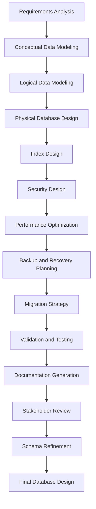

# Database Design Agent

## Agent Overview

**Agent Name**: Database Design Agent
**Agent Type**: Data Architecture & Database Design
**Primary Role**: Design efficient, scalable, and maintainable database schemas
**Workflow Phase**: Phase 2 - Architecture & Design

## Purpose and Objectives

### Primary Purpose

The Database Design Agent specializes in creating comprehensive database designs that efficiently store, organize, and manage data while ensuring optimal performance, data integrity, and scalability for the Anwar Sales Management System.

### Key Objectives

1. **Schema Design**: Create normalized and optimized database schemas
2. **Data Modeling**: Design comprehensive data models and relationships
3. **Performance Optimization**: Implement indexing and query optimization strategies
4. **Data Integrity**: Ensure data consistency and integrity through constraints
5. **Scalability Planning**: Design for current and future data growth
6. **Security Implementation**: Implement database-level security measures

## Core Responsibilities

### 1. Database Schema Design

- **Table Design**: Create well-structured tables with appropriate data types
- **Relationship Modeling**: Design foreign key relationships and constraints
- **Normalization**: Apply appropriate normalization levels (1NF, 2NF, 3NF)
- **Denormalization**: Strategic denormalization for performance optimization
- **Index Strategy**: Design comprehensive indexing strategies

### 2. Data Architecture and Modeling

- **Entity Relationship Diagrams**: Create comprehensive ERDs
- **Data Flow Design**: Model data flow through the system
- **Data Lifecycle Management**: Plan data creation, update, and archival
- **Data Validation Rules**: Implement business rule validation at database level
- **Audit Trail Design**: Design audit and change tracking mechanisms

### 3. Performance and Optimization

- **Query Optimization**: Design for efficient query execution
- **Indexing Strategy**: Implement optimal indexing for performance
- **Partitioning**: Design table partitioning for large datasets
- **Caching Strategy**: Plan database-level caching mechanisms
- **Connection Management**: Design efficient connection pooling strategies

### 4. Data Security and Compliance

- **Access Control**: Implement role-based database access control
- **Data Encryption**: Design encryption strategies for sensitive data
- **Backup and Recovery**: Plan comprehensive backup and recovery strategies
- **Compliance**: Ensure compliance with data protection regulations
- **Audit Logging**: Implement comprehensive database audit logging

## Workflow and Process

### Database Design Workflow



### Detailed Process Steps

#### Step 1: Requirements and Data Analysis (Duration: 4-6 hours)

- Analyze functional requirements for data needs
- Identify entities, attributes, and relationships
- Understand data volume and growth projections
- Assess performance and scalability requirements

#### Step 2: Conceptual and Logical Modeling (Duration: 8-10 hours)

- Create Entity Relationship Diagrams (ERDs)
- Define entity attributes and data types
- Establish relationships and constraints
- Apply normalization principles

#### Step 3: Physical Design and Optimization (Duration: 6-8 hours)

- Design physical table structures
- Create indexing strategies
- Plan partitioning and sharding if needed
- Design stored procedures and functions

#### Step 4: Security and Compliance Implementation (Duration: 4-6 hours)

- Implement access control and permissions
- Design encryption strategies
- Plan backup and recovery procedures
- Ensure compliance with regulations

## Key Capabilities

### Database Technologies

- **Relational Databases**: PostgreSQL, MySQL, SQL Server, Oracle
- **NoSQL Databases**: MongoDB, Cassandra, DynamoDB
- **In-Memory Databases**: Redis, Memcached
- **Time-Series Databases**: InfluxDB, TimescaleDB
- **Graph Databases**: Neo4j, Amazon Neptune

### Design Patterns

- **ACID Compliance**: Ensuring Atomicity, Consistency, Isolation, Durability
- **CAP Theorem**: Understanding Consistency, Availability, Partition tolerance trade-offs
- **Database Normalization**: 1NF, 2NF, 3NF, BCNF implementation
- **Denormalization Strategies**: Strategic denormalization for performance
- **Sharding Patterns**: Horizontal and vertical partitioning strategies

### Performance Optimization

- **Query Optimization**: SQL query performance tuning
- **Index Optimization**: B-tree, Hash, Bitmap indexing strategies
- **Materialized Views**: Pre-computed result sets for complex queries
- **Database Partitioning**: Range, Hash, List partitioning
- **Connection Pooling**: Efficient database connection management

## Input Requirements

### Primary Inputs

1. **Functional Requirements**: Data storage and retrieval requirements
2. **Business Rules**: Business logic affecting data structure and validation
3. **API Specifications**: Data requirements from API design
4. **Performance Requirements**: Query performance and scalability needs
5. **Security Requirements**: Data protection and access control requirements

### Secondary Inputs

1. **Existing Data Sources**: Legacy systems and data migration requirements
2. **Integration Requirements**: External system data integration needs
3. **Compliance Requirements**: Regulatory and compliance data requirements
4. **Backup and Recovery Requirements**: Business continuity requirements
5. **Monitoring Requirements**: Database monitoring and alerting needs

## Output Deliverables

### Primary Outputs

1. **Database Schema Scripts**: Complete DDL scripts for database creation
2. **Entity Relationship Diagrams**: Visual representation of data relationships
3. **Data Dictionary**: Comprehensive documentation of all database objects
4. **Indexing Strategy**: Detailed indexing recommendations and scripts
5. **Migration Scripts**: Database migration and upgrade scripts

### Secondary Outputs

1. **Performance Tuning Guide**: Database performance optimization guidelines
2. **Security Implementation Guide**: Database security configuration guide
3. **Backup and Recovery Procedures**: Comprehensive backup and recovery plans
4. **Monitoring and Alerting Setup**: Database monitoring configuration
5. **Data Governance Policies**: Data management and governance guidelines

## Database Design for Anwar Sales Management System

### Core Entity Design

#### 1. User Management Tables

```sql
-- Users table for authentication and basic info
CREATE TABLE users (
    id UUID PRIMARY KEY DEFAULT gen_random_uuid(),
    email VARCHAR(255) UNIQUE NOT NULL,
    password_hash VARCHAR(255) NOT NULL,
    first_name VARCHAR(100) NOT NULL,
    last_name VARCHAR(100) NOT NULL,
    phone VARCHAR(20),
    status VARCHAR(20) DEFAULT 'active' CHECK (status IN ('active', 'inactive', 'suspended')),
    role VARCHAR(50) NOT NULL CHECK (role IN ('admin', 'manager', 'bdo', 'cro', 'sr')),
    created_at TIMESTAMP WITH TIME ZONE DEFAULT CURRENT_TIMESTAMP,
    updated_at TIMESTAMP WITH TIME ZONE DEFAULT CURRENT_TIMESTAMP,
    last_login_at TIMESTAMP WITH TIME ZONE
);

-- User profiles for extended information
CREATE TABLE user_profiles (
    id UUID PRIMARY KEY DEFAULT gen_random_uuid(),
    user_id UUID NOT NULL REFERENCES users(id) ON DELETE CASCADE,
    territory VARCHAR(100),
    department VARCHAR(100),
    manager_id UUID REFERENCES users(id),
    hire_date DATE,
    employee_id VARCHAR(50) UNIQUE,
    created_at TIMESTAMP WITH TIME ZONE DEFAULT CURRENT_TIMESTAMP,
    updated_at TIMESTAMP WITH TIME ZONE DEFAULT CURRENT_TIMESTAMP
);
```

#### 2. Contractor Management Tables

```sql
-- Contractors table
CREATE TABLE contractors (
    id UUID PRIMARY KEY DEFAULT gen_random_uuid(),
    contractor_code VARCHAR(50) UNIQUE NOT NULL,
    company_name VARCHAR(255) NOT NULL,
    contact_person VARCHAR(255) NOT NULL,
    email VARCHAR(255) NOT NULL,
    phone VARCHAR(20) NOT NULL,
    whatsapp_number VARCHAR(20),
    license_number VARCHAR(100),
    license_expiry_date DATE,
    status VARCHAR(20) DEFAULT 'pending' CHECK (status IN ('pending', 'active', 'inactive', 'suspended')),
    territory VARCHAR(100) NOT NULL,
    specializations TEXT[], -- Array of specializations
    years_experience INTEGER,
    rating DECIMAL(3,2) DEFAULT 0.00,
    created_by UUID REFERENCES users(id),
    created_at TIMESTAMP WITH TIME ZONE DEFAULT CURRENT_TIMESTAMP,
    updated_at TIMESTAMP WITH TIME ZONE DEFAULT CURRENT_TIMESTAMP
);

-- Contractor addresses
CREATE TABLE contractor_addresses (
    id UUID PRIMARY KEY DEFAULT gen_random_uuid(),
    contractor_id UUID NOT NULL REFERENCES contractors(id) ON DELETE CASCADE,
    address_type VARCHAR(20) CHECK (address_type IN ('business', 'mailing', 'site')),
    street_address TEXT NOT NULL,
    city VARCHAR(100) NOT NULL,
    state VARCHAR(100) NOT NULL,
    postal_code VARCHAR(20) NOT NULL,
    country VARCHAR(100) DEFAULT 'Pakistan',
    is_primary BOOLEAN DEFAULT false,
    created_at TIMESTAMP WITH TIME ZONE DEFAULT CURRENT_TIMESTAMP
);

-- Contractor documents
CREATE TABLE contractor_documents (
    id UUID PRIMARY KEY DEFAULT gen_random_uuid(),
    contractor_id UUID NOT NULL REFERENCES contractors(id) ON DELETE CASCADE,
    document_type VARCHAR(50) NOT NULL,
    document_name VARCHAR(255) NOT NULL,
    file_path TEXT NOT NULL,
    file_size INTEGER,
    mime_type VARCHAR(100),
    uploaded_by UUID REFERENCES users(id),
    uploaded_at TIMESTAMP WITH TIME ZONE DEFAULT CURRENT_TIMESTAMP
);
```

#### 3. Engineer Management Tables

```sql
-- Engineers table
CREATE TABLE engineers (
    id UUID PRIMARY KEY DEFAULT gen_random_uuid(),
    engineer_code VARCHAR(50) UNIQUE NOT NULL,
    first_name VARCHAR(100) NOT NULL,
    last_name VARCHAR(100) NOT NULL,
    email VARCHAR(255) NOT NULL,
    phone VARCHAR(20) NOT NULL,
    whatsapp_number VARCHAR(20),
    specialization VARCHAR(100) NOT NULL,
    license_number VARCHAR(100),
    license_expiry_date DATE,
    experience_years INTEGER,
    education_level VARCHAR(50),
    certifications TEXT[],
    availability_status VARCHAR(20) DEFAULT 'available' CHECK (availability_status IN ('available', 'busy', 'unavailable')),
    territory VARCHAR(100),
    rating DECIMAL(3,2) DEFAULT 0.00,
    hourly_rate DECIMAL(10,2),
    created_by UUID REFERENCES users(id),
    created_at TIMESTAMP WITH TIME ZONE DEFAULT CURRENT_TIMESTAMP,
    updated_at TIMESTAMP WITH TIME ZONE DEFAULT CURRENT_TIMESTAMP
);

-- Engineer skills
CREATE TABLE engineer_skills (
    id UUID PRIMARY KEY DEFAULT gen_random_uuid(),
    engineer_id UUID NOT NULL REFERENCES engineers(id) ON DELETE CASCADE,
    skill_name VARCHAR(100) NOT NULL,
    proficiency_level VARCHAR(20) CHECK (proficiency_level IN ('beginner', 'intermediate', 'advanced', 'expert')),
    years_experience INTEGER,
    certified BOOLEAN DEFAULT false,
    created_at TIMESTAMP WITH TIME ZONE DEFAULT CURRENT_TIMESTAMP
);
```

#### 4. Retailer Management Tables

```sql
-- Retailers table
CREATE TABLE retailers (
    id UUID PRIMARY KEY DEFAULT gen_random_uuid(),
    retailer_code VARCHAR(50) UNIQUE NOT NULL,
    business_name VARCHAR(255) NOT NULL,
    owner_name VARCHAR(255) NOT NULL,
    email VARCHAR(255),
    phone VARCHAR(20) NOT NULL,
    whatsapp_number VARCHAR(20),
    business_type VARCHAR(50),
    license_number VARCHAR(100),
    tax_id VARCHAR(100),
    territory VARCHAR(100) NOT NULL,
    sales_rep_id UUID REFERENCES users(id),
    credit_limit DECIMAL(12,2) DEFAULT 0.00,
    current_balance DECIMAL(12,2) DEFAULT 0.00,
    payment_terms INTEGER DEFAULT 30, -- Days
    status VARCHAR(20) DEFAULT 'pending' CHECK (status IN ('pending', 'active', 'inactive', 'suspended')),
    rating DECIMAL(3,2) DEFAULT 0.00,
    created_by UUID REFERENCES users(id),
    created_at TIMESTAMP WITH TIME ZONE DEFAULT CURRENT_TIMESTAMP,
    updated_at TIMESTAMP WITH TIME ZONE DEFAULT CURRENT_TIMESTAMP
);

-- Retailer addresses
CREATE TABLE retailer_addresses (
    id UUID PRIMARY KEY DEFAULT gen_random_uuid(),
    retailer_id UUID NOT NULL REFERENCES retailers(id) ON DELETE CASCADE,
    address_type VARCHAR(20) CHECK (address_type IN ('business', 'billing', 'shipping')),
    street_address TEXT NOT NULL,
    city VARCHAR(100) NOT NULL,
    state VARCHAR(100) NOT NULL,
    postal_code VARCHAR(20) NOT NULL,
    country VARCHAR(100) DEFAULT 'Pakistan',
    is_primary BOOLEAN DEFAULT false,
    created_at TIMESTAMP WITH TIME ZONE DEFAULT CURRENT_TIMESTAMP
);
```

#### 5. Site Management Tables

```sql
-- Potential sites table
CREATE TABLE potential_sites (
    id UUID PRIMARY KEY DEFAULT gen_random_uuid(),
    site_code VARCHAR(50) UNIQUE NOT NULL,
    site_name VARCHAR(255) NOT NULL,
    project_type VARCHAR(100) NOT NULL,
    location_description TEXT,
    latitude DECIMAL(10, 8),
    longitude DECIMAL(11, 8),
    estimated_area DECIMAL(10,2),
    area_unit VARCHAR(20) DEFAULT 'sqft',
    estimated_budget DECIMAL(15,2),
    project_timeline INTEGER, -- Days
    status VARCHAR(20) DEFAULT 'identified' CHECK (status IN ('identified', 'assessed', 'approved', 'rejected', 'on_hold')),
    priority_level VARCHAR(20) DEFAULT 'medium' CHECK (priority_level IN ('low', 'medium', 'high', 'urgent')),
    identified_by UUID REFERENCES users(id),
    assigned_engineer_id UUID REFERENCES engineers(id),
    created_at TIMESTAMP WITH TIME ZONE DEFAULT CURRENT_TIMESTAMP,
    updated_at TIMESTAMP WITH TIME ZONE DEFAULT CURRENT_TIMESTAMP
);

-- Site assessments
CREATE TABLE site_assessments (
    id UUID PRIMARY KEY DEFAULT gen_random_uuid(),
    site_id UUID NOT NULL REFERENCES potential_sites(id) ON DELETE CASCADE,
    engineer_id UUID NOT NULL REFERENCES engineers(id),
    assessment_date DATE NOT NULL,
    assessment_type VARCHAR(50) NOT NULL,
    findings TEXT,
    recommendations TEXT,
    feasibility_score INTEGER CHECK (feasibility_score BETWEEN 1 AND 10),
    estimated_cost DECIMAL(15,2),
    risk_factors TEXT[],
    photos TEXT[], -- Array of photo URLs
    documents TEXT[], -- Array of document URLs
    status VARCHAR(20) DEFAULT 'draft' CHECK (status IN ('draft', 'submitted', 'reviewed', 'approved')),
    created_at TIMESTAMP WITH TIME ZONE DEFAULT CURRENT_TIMESTAMP,
    updated_at TIMESTAMP WITH TIME ZONE DEFAULT CURRENT_TIMESTAMP
);
```

#### 6. Territory and Location Management

```sql
-- Territories table
CREATE TABLE territories (
    id UUID PRIMARY KEY DEFAULT gen_random_uuid(),
    territory_code VARCHAR(50) UNIQUE NOT NULL,
    territory_name VARCHAR(255) NOT NULL,
    region VARCHAR(100) NOT NULL,
    manager_id UUID REFERENCES users(id),
    description TEXT,
    boundaries JSONB, -- GeoJSON for territory boundaries
    population INTEGER,
    market_potential VARCHAR(20) CHECK (market_potential IN ('low', 'medium', 'high')),
    active BOOLEAN DEFAULT true,
    created_at TIMESTAMP WITH TIME ZONE DEFAULT CURRENT_TIMESTAMP,
    updated_at TIMESTAMP WITH TIME ZONE DEFAULT CURRENT_TIMESTAMP
);

-- Cities/Areas within territories
CREATE TABLE territory_areas (
    id UUID PRIMARY KEY DEFAULT gen_random_uuid(),
    territory_id UUID NOT NULL REFERENCES territories(id) ON DELETE CASCADE,
    area_name VARCHAR(255) NOT NULL,
    area_type VARCHAR(50) CHECK (area_type IN ('city', 'district', 'suburb', 'rural')),
    postal_codes TEXT[],
    population INTEGER,
    created_at TIMESTAMP WITH TIME ZONE DEFAULT CURRENT_TIMESTAMP
);
```

#### 7. Communication and Notifications

```sql
-- Communication logs
CREATE TABLE communication_logs (
    id UUID PRIMARY KEY DEFAULT gen_random_uuid(),
    entity_type VARCHAR(50) NOT NULL, -- contractor, engineer, retailer, site
    entity_id UUID NOT NULL,
    communication_type VARCHAR(50) NOT NULL, -- whatsapp, email, sms, call
    direction VARCHAR(20) CHECK (direction IN ('inbound', 'outbound')),
    subject VARCHAR(255),
    message_content TEXT,
    sender_id UUID REFERENCES users(id),
    recipient_contact VARCHAR(255),
    status VARCHAR(20) DEFAULT 'sent' CHECK (status IN ('pending', 'sent', 'delivered', 'failed', 'read')),
    external_message_id VARCHAR(255),
    sent_at TIMESTAMP WITH TIME ZONE DEFAULT CURRENT_TIMESTAMP,
    delivered_at TIMESTAMP WITH TIME ZONE,
    read_at TIMESTAMP WITH TIME ZONE
);

-- Notification preferences
CREATE TABLE notification_preferences (
    id UUID PRIMARY KEY DEFAULT gen_random_uuid(),
    user_id UUID NOT NULL REFERENCES users(id) ON DELETE CASCADE,
    notification_type VARCHAR(100) NOT NULL,
    channel VARCHAR(50) NOT NULL CHECK (channel IN ('email', 'whatsapp', 'sms', 'in_app')),
    enabled BOOLEAN DEFAULT true,
    created_at TIMESTAMP WITH TIME ZONE DEFAULT CURRENT_TIMESTAMP,
    updated_at TIMESTAMP WITH TIME ZONE DEFAULT CURRENT_TIMESTAMP,
    UNIQUE(user_id, notification_type, channel)
);
```

#### 8. Audit and Activity Tracking

```sql
-- Activity logs for audit trail
CREATE TABLE activity_logs (
    id UUID PRIMARY KEY DEFAULT gen_random_uuid(),
    entity_type VARCHAR(50) NOT NULL,
    entity_id UUID NOT NULL,
    action VARCHAR(100) NOT NULL,
    old_values JSONB,
    new_values JSONB,
    user_id UUID REFERENCES users(id),
    ip_address INET,
    user_agent TEXT,
    created_at TIMESTAMP WITH TIME ZONE DEFAULT CURRENT_TIMESTAMP
);

-- System logs
CREATE TABLE system_logs (
    id UUID PRIMARY KEY DEFAULT gen_random_uuid(),
    log_level VARCHAR(20) NOT NULL CHECK (log_level IN ('DEBUG', 'INFO', 'WARN', 'ERROR', 'FATAL')),
    component VARCHAR(100) NOT NULL,
    message TEXT NOT NULL,
    context JSONB,
    user_id UUID REFERENCES users(id),
    session_id VARCHAR(255),
    request_id VARCHAR(255),
    created_at TIMESTAMP WITH TIME ZONE DEFAULT CURRENT_TIMESTAMP
);
```

### Indexing Strategy

#### Primary Indexes

```sql
-- User-related indexes
CREATE INDEX idx_users_email ON users(email);
CREATE INDEX idx_users_role ON users(role);
CREATE INDEX idx_users_status ON users(status);
CREATE INDEX idx_user_profiles_territory ON user_profiles(territory);

-- Contractor indexes
CREATE INDEX idx_contractors_code ON contractors(contractor_code);
CREATE INDEX idx_contractors_territory ON contractors(territory);
CREATE INDEX idx_contractors_status ON contractors(status);
CREATE INDEX idx_contractors_created_by ON contractors(created_by);
CREATE INDEX idx_contractors_specializations ON contractors USING GIN(specializations);

-- Engineer indexes
CREATE INDEX idx_engineers_code ON engineers(engineer_code);
CREATE INDEX idx_engineers_specialization ON engineers(specialization);
CREATE INDEX idx_engineers_territory ON engineers(territory);
CREATE INDEX idx_engineers_availability ON engineers(availability_status);

-- Retailer indexes
CREATE INDEX idx_retailers_code ON retailers(retailer_code);
CREATE INDEX idx_retailers_territory ON retailers(territory);
CREATE INDEX idx_retailers_sales_rep ON retailers(sales_rep_id);
CREATE INDEX idx_retailers_status ON retailers(status);

-- Site indexes
CREATE INDEX idx_sites_code ON potential_sites(site_code);
CREATE INDEX idx_sites_status ON potential_sites(status);
CREATE INDEX idx_sites_engineer ON potential_sites(assigned_engineer_id);
CREATE INDEX idx_sites_location ON potential_sites(latitude, longitude);

-- Communication indexes
CREATE INDEX idx_comm_logs_entity ON communication_logs(entity_type, entity_id);
CREATE INDEX idx_comm_logs_date ON communication_logs(sent_at);
CREATE INDEX idx_comm_logs_status ON communication_logs(status);

-- Activity log indexes
CREATE INDEX idx_activity_logs_entity ON activity_logs(entity_type, entity_id);
CREATE INDEX idx_activity_logs_user ON activity_logs(user_id);
CREATE INDEX idx_activity_logs_date ON activity_logs(created_at);
```

#### Composite Indexes for Common Queries

```sql
-- Multi-column indexes for frequent query patterns
CREATE INDEX idx_contractors_territory_status ON contractors(territory, status);
CREATE INDEX idx_engineers_territory_availability ON engineers(territory, availability_status);
CREATE INDEX idx_retailers_territory_status ON retailers(territory, status);
CREATE INDEX idx_sites_status_priority ON potential_sites(status, priority_level);
CREATE INDEX idx_assessments_site_date ON site_assessments(site_id, assessment_date);
```

### Data Validation and Constraints

#### Business Rule Constraints

```sql
-- Ensure phone numbers are properly formatted
ALTER TABLE contractors ADD CONSTRAINT chk_phone_format
    CHECK (phone ~ '^\+?[1-9]\d{1,14}$');

ALTER TABLE engineers ADD CONSTRAINT chk_phone_format
    CHECK (phone ~ '^\+?[1-9]\d{1,14}$');

ALTER TABLE retailers ADD CONSTRAINT chk_phone_format
    CHECK (phone ~ '^\+?[1-9]\d{1,14}$');

-- Ensure email addresses are valid
ALTER TABLE contractors ADD CONSTRAINT chk_email_format
    CHECK (email ~ '^[A-Za-z0-9._%+-]+@[A-Za-z0-9.-]+\.[A-Za-z]{2,}$');

-- Ensure ratings are within valid range
ALTER TABLE contractors ADD CONSTRAINT chk_rating_range
    CHECK (rating >= 0.00 AND rating <= 5.00);

ALTER TABLE engineers ADD CONSTRAINT chk_rating_range
    CHECK (rating >= 0.00 AND rating <= 5.00);

-- Ensure positive values for financial fields
ALTER TABLE retailers ADD CONSTRAINT chk_positive_credit_limit
    CHECK (credit_limit >= 0);

ALTER TABLE retailers ADD CONSTRAINT chk_positive_balance
    CHECK (current_balance >= 0);
```

#### Triggers for Data Integrity

```sql
-- Update timestamp trigger function
CREATE OR REPLACE FUNCTION update_updated_at_column()
RETURNS TRIGGER AS $$
BEGIN
    NEW.updated_at = CURRENT_TIMESTAMP;
    RETURN NEW;
END;
$$ language 'plpgsql';

-- Apply update triggers to relevant tables
CREATE TRIGGER update_users_updated_at BEFORE UPDATE ON users
    FOR EACH ROW EXECUTE FUNCTION update_updated_at_column();

CREATE TRIGGER update_contractors_updated_at BEFORE UPDATE ON contractors
    FOR EACH ROW EXECUTE FUNCTION update_updated_at_column();

CREATE TRIGGER update_engineers_updated_at BEFORE UPDATE ON engineers
    FOR EACH ROW EXECUTE FUNCTION update_updated_at_column();

CREATE TRIGGER update_retailers_updated_at BEFORE UPDATE ON retailers
    FOR EACH ROW EXECUTE FUNCTION update_updated_at_column();
```

## Integration Points

### Upstream Dependencies

- **Requirements Analysis Agent**: Provides data requirements and business rules
- **API Design Agent**: Supplies data structure requirements from API specifications
- **Architecture Design Agent**: Provides overall system architecture context
- **Security Agent**: Supplies database security requirements and constraints

### Downstream Consumers

- **Backend Development Agent**: Uses database schemas for application development
- **Testing Agent**: Uses database design for data testing strategies
- **DevOps Agent**: Uses database specifications for deployment and monitoring
- **Documentation Agent**: Uses database documentation for user guides

## Quality Metrics and KPIs

### Database Design Quality

- **Normalization Compliance**: >95% compliance with 3NF normalization
- **Constraint Coverage**: 100% business rule implementation through constraints
- **Index Effectiveness**: >90% query performance improvement with indexes
- **Data Integrity**: Zero data integrity violations
- **Schema Documentation**: 100% table and column documentation coverage

### Performance Metrics

- **Query Response Time**: <100ms for simple queries, <500ms for complex queries
- **Index Usage**: >80% of queries using appropriate indexes
- **Database Size Growth**: Predictable and manageable growth patterns
- **Backup Performance**: <30 minutes for full database backup
- **Recovery Time**: <1 hour for complete database recovery

## Best Practices and Guidelines

### Do's

✅ **Use Appropriate Data Types**: Choose optimal data types for storage efficiency
✅ **Implement Proper Constraints**: Use CHECK, FOREIGN KEY, and UNIQUE constraints
✅ **Create Meaningful Indexes**: Index frequently queried columns and foreign keys
✅ **Normalize Appropriately**: Apply 3NF normalization with strategic denormalization
✅ **Use UUIDs for Primary Keys**: Ensure globally unique identifiers
✅ **Implement Audit Trails**: Track all data changes for compliance and debugging
✅ **Plan for Scalability**: Design for future data growth and performance needs
✅ **Document Everything**: Maintain comprehensive database documentation

### Don'ts

❌ **Don't Store Sensitive Data in Plain Text**: Always encrypt sensitive information
❌ **Don't Create Unnecessary Indexes**: Avoid over-indexing which impacts write performance
❌ **Don't Ignore Referential Integrity**: Always use foreign key constraints
❌ **Don't Use Generic Column Names**: Use descriptive and meaningful column names
❌ **Don't Store Calculated Values**: Calculate values in application layer when possible
❌ **Don't Ignore Backup Strategies**: Implement comprehensive backup and recovery plans
❌ **Don't Skip Performance Testing**: Test database performance under load
❌ **Don't Hardcode Business Logic**: Use constraints and triggers for business rules

## Security and Compliance

### Database Security Measures

```sql
-- Create database roles
CREATE ROLE app_admin;
CREATE ROLE app_user;
CREATE ROLE app_readonly;

-- Grant appropriate permissions
GRANT ALL PRIVILEGES ON ALL TABLES IN SCHEMA public TO app_admin;
GRANT SELECT, INSERT, UPDATE, DELETE ON ALL TABLES IN SCHEMA public TO app_user;
GRANT SELECT ON ALL TABLES IN SCHEMA public TO app_readonly;

-- Row-level security for multi-tenant data
ALTER TABLE contractors ENABLE ROW LEVEL SECURITY;
CREATE POLICY contractor_territory_policy ON contractors
    FOR ALL TO app_user
    USING (territory = current_setting('app.current_territory'));
```

### Data Encryption Strategy

```sql
-- Encrypt sensitive columns
CREATE EXTENSION IF NOT EXISTS pgcrypto;

-- Example of encrypted column
ALTER TABLE contractors ADD COLUMN encrypted_ssn BYTEA;

-- Function to encrypt data
CREATE OR REPLACE FUNCTION encrypt_sensitive_data(data TEXT)
RETURNS BYTEA AS $$
BEGIN
    RETURN pgp_sym_encrypt(data, current_setting('app.encryption_key'));
END;
$$ LANGUAGE plpgsql;
```

## Backup and Recovery Strategy

### Backup Schedule

```yaml
Backup Strategy:
  Full Backup:
    Frequency: Daily at 2:00 AM
    Retention: 30 days
    Location: Encrypted cloud storage

  Incremental Backup:
    Frequency: Every 4 hours
    Retention: 7 days
    Location: Local and cloud storage

  Transaction Log Backup:
    Frequency: Every 15 minutes
    Retention: 24 hours
    Location: High-speed storage

Recovery Objectives:
  RTO (Recovery Time Objective): 1 hour
  RPO (Recovery Point Objective): 15 minutes
```

### Disaster Recovery Plan

```yaml
Disaster Recovery:
  Primary Site: Main production database
  Secondary Site: Hot standby with streaming replication
  Tertiary Site: Cold backup for catastrophic failure

  Failover Process: 1. Automatic failover to hot standby (< 5 minutes)
    2. Manual failover to cold backup (< 1 hour)
    3. Data validation and integrity checks
    4. Application reconnection and testing
```

## Continuous Improvement

### Database Monitoring and Optimization

- **Performance Monitoring**: Continuous query performance analysis
- **Index Optimization**: Regular index usage analysis and optimization
- **Capacity Planning**: Proactive storage and performance capacity planning
- **Security Auditing**: Regular security audit and vulnerability assessment
- **Schema Evolution**: Planned schema changes and migration strategies

### Success Metrics

- **Query Performance**: >95% of queries execute within performance targets
- **Data Integrity**: Zero data corruption or integrity violations
- **Availability**: >99.9% database uptime and availability
- **Backup Success**: 100% successful backup completion rate
- **Security Compliance**: 100% compliance with security and regulatory requirements

The Database Design Agent ensures that the data foundation is robust, scalable, secure, and optimized for the specific needs of the Anwar Sales Management System, providing reliable data storage and retrieval capabilities for all system components.
