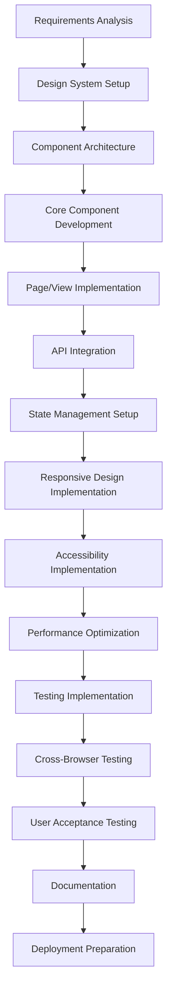

# Frontend Development Agent

## Agent Overview

**Agent Name**: Frontend Development Agent
**Agent Type**: User Interface & Experience Development
**Primary Role**: Build responsive, intuitive, and accessible user interfaces
**Workflow Phase**: Phase 3 - Development & Implementation

## Purpose and Objectives

### Primary Purpose

The Frontend Development Agent specializes in creating modern, responsive, and user-friendly web and mobile interfaces that provide exceptional user experience while ensuring accessibility, performance, and maintainability for the Anwar Sales Management System.

### Key Objectives

1. **User Interface Development**: Create intuitive and responsive user interfaces
2. **User Experience Optimization**: Implement best UX practices and design patterns
3. **Cross-Platform Compatibility**: Ensure compatibility across devices and browsers
4. **Performance Optimization**: Implement fast-loading and efficient frontend solutions
5. **Accessibility Compliance**: Ensure WCAG 2.1 AA compliance for all users
6. **Component Architecture**: Build reusable and maintainable component libraries

## Core Responsibilities

### 1. User Interface Development

- **Component Development**: Create reusable UI components and design systems
- **Layout Implementation**: Build responsive layouts using modern CSS frameworks
- **Interactive Elements**: Implement dynamic user interactions and animations
- **Form Development**: Create comprehensive forms with validation and error handling
- **Navigation Systems**: Build intuitive navigation and routing systems

### 2. User Experience Implementation

- **Design System Implementation**: Translate design mockups into functional interfaces
- **Responsive Design**: Ensure optimal experience across all device sizes
- **Performance Optimization**: Implement lazy loading, code splitting, and caching
- **Accessibility Features**: Implement screen reader support and keyboard navigation
- **User Feedback Systems**: Create loading states, error messages, and success notifications

### 3. State Management and Data Flow

- **State Management**: Implement efficient state management solutions
- **API Integration**: Connect frontend with backend APIs and handle data flow
- **Real-time Updates**: Implement WebSocket connections for live data updates
- **Offline Capabilities**: Build progressive web app features for offline usage
- **Data Caching**: Implement client-side caching strategies

### 4. Testing and Quality Assurance

- **Unit Testing**: Write comprehensive tests for components and utilities
- **Integration Testing**: Test component interactions and data flow
- **End-to-End Testing**: Implement user journey testing scenarios
- **Cross-Browser Testing**: Ensure compatibility across different browsers
- **Performance Testing**: Monitor and optimize frontend performance metrics

## Workflow and Process

### Frontend Development Workflow



### Detailed Process Steps

#### Step 1: Setup and Architecture (Duration: 8-12 hours)

- Set up development environment and build tools
- Configure project structure and component architecture
- Implement design system and component library
- Set up routing and state management

#### Step 2: Core Development (Duration: 40-60 hours)

- Develop reusable UI components
- Implement main application pages and views
- Integrate with backend APIs
- Implement user authentication and authorization

#### Step 3: Enhancement and Optimization (Duration: 20-30 hours)

- Implement responsive design and mobile optimization
- Add accessibility features and WCAG compliance
- Optimize performance and implement caching
- Add progressive web app features

#### Step 4: Testing and Quality Assurance (Duration: 16-24 hours)

- Write and execute unit and integration tests
- Perform cross-browser and device testing
- Conduct user acceptance testing
- Performance testing and optimization

## Key Capabilities

### Frontend Technologies

- **Frameworks**: React.js, Vue.js, Angular, Svelte
- **Mobile Development**: React Native, Flutter, Ionic
- **CSS Frameworks**: Tailwind CSS, Bootstrap, Material-UI, Chakra UI
- **Build Tools**: Webpack, Vite, Parcel, Rollup
- **Testing**: Jest, Cypress, Testing Library, Playwright

### Development Patterns

- **Component-Based Architecture**: Modular and reusable component design
- **State Management Patterns**: Redux, Zustand, Context API, Pinia
- **Design Patterns**: Container/Presentational, Higher-Order Components, Hooks
- **Performance Patterns**: Code splitting, lazy loading, memoization
- **Accessibility Patterns**: ARIA implementation, semantic HTML, keyboard navigation

### UI/UX Best Practices

- **Responsive Design**: Mobile-first approach with breakpoint optimization
- **Design Systems**: Consistent typography, colors, spacing, and components
- **User Feedback**: Loading states, error handling, success notifications
- **Navigation**: Intuitive menu structures and breadcrumb navigation
- **Form Design**: Progressive disclosure, inline validation, clear error messages

## Input Requirements

### Primary Inputs

1. **Design Specifications**: UI/UX mockups, wireframes, and design systems
2. **API Documentation**: Backend API specifications and data structures
3. **User Requirements**: User stories, personas, and journey maps
4. **Technical Requirements**: Performance, accessibility, and browser support requirements
5. **Brand Guidelines**: Logo, colors, typography, and brand identity elements

### Secondary Inputs

1. **Content Strategy**: Text content, images, and multimedia requirements
2. **SEO Requirements**: Meta tags, structured data, and search optimization
3. **Analytics Requirements**: User tracking and analytics implementation needs
4. **Security Requirements**: Authentication, authorization, and data protection needs
5. **Integration Requirements**: Third-party service integrations and APIs

## Output Deliverables

### Primary Outputs

1. **Web Application**: Complete responsive web application
2. **Mobile Application**: Native or hybrid mobile application (if required)
3. **Component Library**: Reusable UI component library with documentation
4. **Style Guide**: Comprehensive CSS/SCSS style guide and design tokens
5. **Build Configuration**: Optimized build and deployment configuration

### Secondary Outputs

1. **Testing Suite**: Comprehensive test coverage for all components and features
2. **Performance Report**: Frontend performance analysis and optimization recommendations
3. **Accessibility Audit**: WCAG compliance report and accessibility features documentation
4. **Browser Compatibility Matrix**: Tested browser and device compatibility report
5. **Deployment Guide**: Frontend deployment and hosting configuration guide

## Technology Stack for Anwar Sales Management System

### Recommended Frontend Stack

#### Web Application

```yaml
Framework: React.js 18+ with TypeScript
UI Library: Material-UI (MUI) v5 or Chakra UI
Styling: Tailwind CSS with CSS Modules
State Management: Zustand or Redux Toolkit
Routing: React Router v6
Form Handling: React Hook Form with Zod validation
HTTP Client: Axios with React Query
Testing: Jest + React Testing Library + Cypress
Build Tool: Vite
Linting: ESLint + Prettier
```

#### Mobile Application (Optional)

```yaml
Framework: React Native with TypeScript
Navigation: React Navigation v6
UI Components: NativeBase or React Native Elements
State Management: Zustand
HTTP Client: Axios
Testing: Jest + React Native Testing Library
Build Tool: Metro bundler
```

### Project Structure

```
src/
├── components/           # Reusable UI components
│   ├── common/          # Generic components (Button, Input, Modal)
│   ├── forms/           # Form-specific components
│   ├── layout/          # Layout components (Header, Sidebar, Footer)
│   └── charts/          # Data visualization components
├── pages/               # Page components
│   ├── auth/           # Authentication pages
│   ├── dashboard/      # Dashboard and analytics
│   ├── contractors/    # Contractor management
│   ├── engineers/      # Engineer management
│   ├── retailers/      # Retailer management
│   └── sites/          # Site management
├── hooks/              # Custom React hooks
├── services/           # API services and utilities
├── store/              # State management
├── utils/              # Utility functions
├── types/              # TypeScript type definitions
├── styles/             # Global styles and themes
└── assets/             # Static assets (images, icons)
```

## Component Architecture

### Core Component Library

#### 1. Layout Components

```typescript
// AppLayout.tsx - Main application layout
import React from "react";
import { Box, Container } from "@mui/material";
import { Header } from "./Header";
import { Sidebar } from "./Sidebar";
import { Footer } from "./Footer";

interface AppLayoutProps {
  children: React.ReactNode;
  showSidebar?: boolean;
}

export const AppLayout: React.FC<AppLayoutProps> = ({
  children,
  showSidebar = true,
}) => {
  return (
    <Box sx={{ display: "flex", minHeight: "100vh" }}>
      {showSidebar && <Sidebar />}
      <Box sx={{ flexGrow: 1, display: "flex", flexDirection: "column" }}>
        <Header />
        <Container component="main" sx={{ flexGrow: 1, py: 3 }} maxWidth="xl">
          {children}
        </Container>
        <Footer />
      </Box>
    </Box>
  );
};
```

#### 2. Data Display Components

```typescript
// DataTable.tsx - Reusable data table component
import React from "react";
import {
  Table,
  TableBody,
  TableCell,
  TableContainer,
  TableHead,
  TableRow,
  TablePagination,
  Paper,
  Checkbox,
  IconButton,
  Tooltip,
} from "@mui/material";
import { Edit, Delete, Visibility } from "@mui/icons-material";

interface Column {
  id: string;
  label: string;
  minWidth?: number;
  align?: "right" | "left" | "center";
  format?: (value: any) => string;
}

interface DataTableProps {
  columns: Column[];
  data: any[];
  onEdit?: (id: string) => void;
  onDelete?: (id: string) => void;
  onView?: (id: string) => void;
  selectable?: boolean;
  onSelectionChange?: (selected: string[]) => void;
}

export const DataTable: React.FC<DataTableProps> = ({
  columns,
  data,
  onEdit,
  onDelete,
  onView,
  selectable = false,
  onSelectionChange,
}) => {
  const [page, setPage] = React.useState(0);
  const [rowsPerPage, setRowsPerPage] = React.useState(10);
  const [selected, setSelected] = React.useState<string[]>([]);

  const handleSelectAll = (event: React.ChangeEvent<HTMLInputElement>) => {
    if (event.target.checked) {
      const newSelected = data.map((row) => row.id);
      setSelected(newSelected);
      onSelectionChange?.(newSelected);
    } else {
      setSelected([]);
      onSelectionChange?.([]);
    }
  };

  const handleSelect = (id: string) => {
    const selectedIndex = selected.indexOf(id);
    let newSelected: string[] = [];

    if (selectedIndex === -1) {
      newSelected = newSelected.concat(selected, id);
    } else if (selectedIndex === 0) {
      newSelected = newSelected.concat(selected.slice(1));
    } else if (selectedIndex === selected.length - 1) {
      newSelected = newSelected.concat(selected.slice(0, -1));
    } else if (selectedIndex > 0) {
      newSelected = newSelected.concat(
        selected.slice(0, selectedIndex),
        selected.slice(selectedIndex + 1)
      );
    }

    setSelected(newSelected);
    onSelectionChange?.(newSelected);
  };

  return (
    <Paper sx={{ width: "100%", overflow: "hidden" }}>
      <TableContainer sx={{ maxHeight: 440 }}>
        <Table stickyHeader aria-label="data table">
          <TableHead>
            <TableRow>
              {selectable && (
                <TableCell padding="checkbox">
                  <Checkbox
                    indeterminate={
                      selected.length > 0 && selected.length < data.length
                    }
                    checked={data.length > 0 && selected.length === data.length}
                    onChange={handleSelectAll}
                  />
                </TableCell>
              )}
              {columns.map((column) => (
                <TableCell
                  key={column.id}
                  align={column.align}
                  style={{ minWidth: column.minWidth }}
                >
                  {column.label}
                </TableCell>
              ))}
              <TableCell align="center">Actions</TableCell>
            </TableRow>
          </TableHead>
          <TableBody>
            {data
              .slice(page * rowsPerPage, page * rowsPerPage + rowsPerPage)
              .map((row) => {
                const isSelected = selected.indexOf(row.id) !== -1;
                return (
                  <TableRow
                    hover
                    role="checkbox"
                    tabIndex={-1}
                    key={row.id}
                    selected={isSelected}
                  >
                    {selectable && (
                      <TableCell padding="checkbox">
                        <Checkbox
                          checked={isSelected}
                          onChange={() => handleSelect(row.id)}
                        />
                      </TableCell>
                    )}
                    {columns.map((column) => {
                      const value = row[column.id];
                      return (
                        <TableCell key={column.id} align={column.align}>
                          {column.format ? column.format(value) : value}
                        </TableCell>
                      );
                    })}
                    <TableCell align="center">
                      {onView && (
                        <Tooltip title="View">
                          <IconButton onClick={() => onView(row.id)}>
                            <Visibility />
                          </IconButton>
                        </Tooltip>
                      )}
                      {onEdit && (
                        <Tooltip title="Edit">
                          <IconButton onClick={() => onEdit(row.id)}>
                            <Edit />
                          </IconButton>
                        </Tooltip>
                      )}
                      {onDelete && (
                        <Tooltip title="Delete">
                          <IconButton onClick={() => onDelete(row.id)}>
                            <Delete />
                          </IconButton>
                        </Tooltip>
                      )}
                    </TableCell>
                  </TableRow>
                );
              })}
          </TableBody>
        </Table>
      </TableContainer>
      <TablePagination
        rowsPerPageOptions={[10, 25, 100]}
        component="div"
        count={data.length}
        rowsPerPage={rowsPerPage}
        page={page}
        onPageChange={(_, newPage) => setPage(newPage)}
        onRowsPerPageChange={(event) => {
          setRowsPerPage(+event.target.value);
          setPage(0);
        }}
      />
    </Paper>
  );
};
```

#### 3. Form Components

```typescript
// FormField.tsx - Reusable form field component
import React from "react";
import {
  TextField,
  Select,
  MenuItem,
  FormControl,
  InputLabel,
  FormHelperText,
  Checkbox,
  FormControlLabel,
  RadioGroup,
  Radio,
  Autocomplete,
} from "@mui/material";
import { Controller, Control, FieldError } from "react-hook-form";

interface Option {
  value: string | number;
  label: string;
}

interface FormFieldProps {
  name: string;
  control: Control<any>;
  label: string;
  type?:
    | "text"
    | "email"
    | "password"
    | "number"
    | "select"
    | "checkbox"
    | "radio"
    | "autocomplete";
  options?: Option[];
  required?: boolean;
  disabled?: boolean;
  multiline?: boolean;
  rows?: number;
  error?: FieldError;
  helperText?: string;
}

export const FormField: React.FC<FormFieldProps> = ({
  name,
  control,
  label,
  type = "text",
  options = [],
  required = false,
  disabled = false,
  multiline = false,
  rows = 1,
  error,
  helperText,
}) => {
  const renderField = () => {
    switch (type) {
      case "select":
        return (
          <Controller
            name={name}
            control={control}
            render={({ field }) => (
              <FormControl fullWidth error={!!error} disabled={disabled}>
                <InputLabel>{label}</InputLabel>
                <Select {...field} label={label}>
                  {options.map((option) => (
                    <MenuItem key={option.value} value={option.value}>
                      {option.label}
                    </MenuItem>
                  ))}
                </Select>
                {(error || helperText) && (
                  <FormHelperText>
                    {error?.message || helperText}
                  </FormHelperText>
                )}
              </FormControl>
            )}
          />
        );

      case "checkbox":
        return (
          <Controller
            name={name}
            control={control}
            render={({ field }) => (
              <FormControlLabel
                control={
                  <Checkbox
                    {...field}
                    checked={field.value || false}
                    disabled={disabled}
                  />
                }
                label={label}
              />
            )}
          />
        );

      case "radio":
        return (
          <Controller
            name={name}
            control={control}
            render={({ field }) => (
              <FormControl
                component="fieldset"
                error={!!error}
                disabled={disabled}
              >
                <InputLabel component="legend">{label}</InputLabel>
                <RadioGroup {...field}>
                  {options.map((option) => (
                    <FormControlLabel
                      key={option.value}
                      value={option.value}
                      control={<Radio />}
                      label={option.label}
                    />
                  ))}
                </RadioGroup>
                {(error || helperText) && (
                  <FormHelperText>
                    {error?.message || helperText}
                  </FormHelperText>
                )}
              </FormControl>
            )}
          />
        );

      case "autocomplete":
        return (
          <Controller
            name={name}
            control={control}
            render={({ field }) => (
              <Autocomplete
                {...field}
                options={options}
                getOptionLabel={(option) => option.label}
                isOptionEqualToValue={(option, value) =>
                  option.value === value.value
                }
                disabled={disabled}
                onChange={(_, value) => field.onChange(value)}
                renderInput={(params) => (
                  <TextField
                    {...params}
                    label={label}
                    required={required}
                    error={!!error}
                    helperText={error?.message || helperText}
                  />
                )}
              />
            )}
          />
        );

      default:
        return (
          <Controller
            name={name}
            control={control}
            render={({ field }) => (
              <TextField
                {...field}
                label={label}
                type={type}
                required={required}
                disabled={disabled}
                multiline={multiline}
                rows={rows}
                fullWidth
                error={!!error}
                helperText={error?.message || helperText}
              />
            )}
          />
        );
    }
  };

  return renderField();
};
```

### Page Components

#### 1. Dashboard Page

```typescript
// Dashboard.tsx - Main dashboard page
import React from "react";
import { Grid, Card, CardContent, Typography, Box, Paper } from "@mui/material";
import { TrendingUp, People, Business, LocationOn } from "@mui/icons-material";
import { StatCard } from "../components/StatCard";
import { ChartCard } from "../components/ChartCard";
import { RecentActivity } from "../components/RecentActivity";

export const Dashboard: React.FC = () => {
  const stats = [
    {
      title: "Total Contractors",
      value: "1,234",
      change: "+12%",
      icon: <People />,
      color: "primary",
    },
    {
      title: "Active Engineers",
      value: "567",
      change: "+8%",
      icon: <Business />,
      color: "success",
    },
    {
      title: "Registered Retailers",
      value: "890",
      change: "+15%",
      icon: <TrendingUp />,
      color: "info",
    },
    {
      title: "Potential Sites",
      value: "234",
      change: "+5%",
      icon: <LocationOn />,
      color: "warning",
    },
  ];

  return (
    <Box>
      <Typography variant="h4" component="h1" gutterBottom>
        Dashboard
      </Typography>

      <Grid container spacing={3}>
        {/* Statistics Cards */}
        {stats.map((stat, index) => (
          <Grid item xs={12} sm={6} md={3} key={index}>
            <StatCard {...stat} />
          </Grid>
        ))}

        {/* Charts */}
        <Grid item xs={12} md={8}>
          <ChartCard
            title="Registration Trends"
            type="line"
            data={/* chart data */}
          />
        </Grid>

        <Grid item xs={12} md={4}>
          <ChartCard
            title="Territory Distribution"
            type="pie"
            data={/* chart data */}
          />
        </Grid>

        {/* Recent Activity */}
        <Grid item xs={12}>
          <RecentActivity />
        </Grid>
      </Grid>
    </Box>
  );
};
```

#### 2. Contractor Management Page

```typescript
// ContractorList.tsx - Contractor management page
import React, { useState, useEffect } from "react";
import {
  Box,
  Typography,
  Button,
  TextField,
  InputAdornment,
  Chip,
  Stack,
} from "@mui/material";
import { Add, Search, FilterList } from "@mui/icons-material";
import { DataTable } from "../components/DataTable";
import { ContractorForm } from "../components/ContractorForm";
import { useContractors } from "../hooks/useContractors";

const columns = [
  { id: "contractorCode", label: "Code", minWidth: 100 },
  { id: "companyName", label: "Company Name", minWidth: 200 },
  { id: "contactPerson", label: "Contact Person", minWidth: 150 },
  { id: "territory", label: "Territory", minWidth: 120 },
  {
    id: "status",
    label: "Status",
    minWidth: 100,
    format: (value: string) => (
      <Chip
        label={value}
        color={value === "active" ? "success" : "default"}
        size="small"
      />
    ),
  },
  { id: "rating", label: "Rating", minWidth: 80, align: "center" as const },
];

export const ContractorList: React.FC = () => {
  const [searchTerm, setSearchTerm] = useState("");
  const [statusFilter, setStatusFilter] = useState<string[]>([]);
  const [isFormOpen, setIsFormOpen] = useState(false);
  const [selectedContractor, setSelectedContractor] = useState<string | null>(
    null
  );

  const {
    contractors,
    loading,
    error,
    fetchContractors,
    createContractor,
    updateContractor,
    deleteContractor,
  } = useContractors();

  useEffect(() => {
    fetchContractors({ search: searchTerm, status: statusFilter });
  }, [searchTerm, statusFilter]);

  const handleEdit = (id: string) => {
    setSelectedContractor(id);
    setIsFormOpen(true);
  };

  const handleDelete = async (id: string) => {
    if (window.confirm("Are you sure you want to delete this contractor?")) {
      await deleteContractor(id);
    }
  };

  const handleFormSubmit = async (data: any) => {
    if (selectedContractor) {
      await updateContractor(selectedContractor, data);
    } else {
      await createContractor(data);
    }
    setIsFormOpen(false);
    setSelectedContractor(null);
  };

  return (
    <Box>
      <Box
        display="flex"
        justifyContent="space-between"
        alignItems="center"
        mb={3}
      >
        <Typography variant="h4" component="h1">
          Contractors
        </Typography>
        <Button
          variant="contained"
          startIcon={<Add />}
          onClick={() => setIsFormOpen(true)}
        >
          Add Contractor
        </Button>
      </Box>

      <Box mb={3}>
        <Stack direction="row" spacing={2} alignItems="center">
          <TextField
            placeholder="Search contractors..."
            value={searchTerm}
            onChange={(e) => setSearchTerm(e.target.value)}
            InputProps={{
              startAdornment: (
                <InputAdornment position="start">
                  <Search />
                </InputAdornment>
              ),
            }}
            sx={{ minWidth: 300 }}
          />
          <Button
            variant="outlined"
            startIcon={<FilterList />}
            onClick={() => {
              /* Open filter dialog */
            }}
          >
            Filters
          </Button>
        </Stack>
      </Box>

      <DataTable
        columns={columns}
        data={contractors}
        onEdit={handleEdit}
        onDelete={handleDelete}
        selectable
      />

      <ContractorForm
        open={isFormOpen}
        contractorId={selectedContractor}
        onClose={() => {
          setIsFormOpen(false);
          setSelectedContractor(null);
        }}
        onSubmit={handleFormSubmit}
      />
    </Box>
  );
};
```

## State Management

### Zustand Store Setup

```typescript
// stores/authStore.ts
import { create } from 'zustand';
import { persist } from 'zustand/middleware';

interface User {
  id: string;
  email: string;
  firstName: string;
  lastName: string;
  role: string;
  territory?: string;
}

interface AuthState {
  user: User | null;
  token: string | null;
  isAuthenticated: boolean;
  login: (email: string, password: string) => Promise<void>;
  logout: () => void;
  updateProfile: (data: Partial<User>) => void;
}

export const useAuthStore = create<AuthState>()(n  persist(
    (set, get) => ({
      user: null,
      token: null,
      isAuthenticated: false,

      login: async (email: string, password: string) => {
        try {
          const response = await authService.login(email, password);
          set({
            user: response.user,
            token: response.token,
            isAuthenticated: true
          });
        } catch (error) {
          throw error;
        }
      },

      logout: () => {
        set({
          user: null,
          token: null,
          isAuthenticated: false
        });
      },

      updateProfile: (data: Partial<User>) => {
        const currentUser = get().user;
        if (currentUser) {
          set({
            user: { ...currentUser, ...data }
          });
        }
      }
    }),
    {
      name: 'auth-storage',
      partialize: (state) => ({
        user: state.user,
        token: state.token,
        isAuthenticated: state.isAuthenticated
      })
    }
  )
);
```

## Integration Points

### Upstream Dependencies

- **API Design Agent**: Provides API specifications and data structures
- **Database Design Agent**: Supplies data models and relationships
- **UI/UX Design Agent**: Provides design mockups and user experience guidelines
- **Security Agent**: Supplies authentication and authorization requirements

### Downstream Consumers

- **Testing Agent**: Uses frontend components for testing scenarios
- **DevOps Agent**: Uses build artifacts for deployment
- **Documentation Agent**: Uses component documentation for user guides
- **Performance Monitoring**: Uses frontend metrics for optimization

## Quality Metrics and KPIs

### Performance Metrics

- **First Contentful Paint (FCP)**: <1.5 seconds
- **Largest Contentful Paint (LCP)**: <2.5 seconds
- **First Input Delay (FID)**: <100 milliseconds
- **Cumulative Layout Shift (CLS)**: <0.1
- **Bundle Size**: <500KB gzipped for initial load

### Code Quality Metrics

- **Test Coverage**: >90% for components and utilities
- **TypeScript Coverage**: 100% type safety
- **ESLint Compliance**: Zero linting errors
- **Accessibility Score**: >95% WCAG 2.1 AA compliance
- **Component Reusability**: >80% of UI elements as reusable components

## Best Practices and Guidelines

### Do's

✅ **Use TypeScript**: Ensure type safety and better developer experience
✅ **Implement Responsive Design**: Mobile-first approach with breakpoint optimization
✅ **Follow Accessibility Guidelines**: WCAG 2.1 AA compliance for all components
✅ **Optimize Performance**: Implement code splitting, lazy loading, and caching
✅ **Write Comprehensive Tests**: Unit, integration, and e2e test coverage
✅ **Use Semantic HTML**: Proper HTML structure for SEO and accessibility
✅ **Implement Error Boundaries**: Graceful error handling and user feedback
✅ **Follow Design System**: Consistent UI patterns and component usage

### Don'ts

❌ **Don't Ignore Performance**: Avoid large bundle sizes and slow loading times
❌ **Don't Skip Accessibility**: Never compromise on accessibility features
❌ **Don't Hardcode Values**: Use configuration and environment variables
❌ **Don't Ignore Browser Compatibility**: Test across different browsers and devices
❌ **Don't Skip Error Handling**: Always handle API errors and edge cases
❌ **Don't Use Inline Styles**: Maintain separation of concerns with CSS modules
❌ **Don't Ignore SEO**: Implement proper meta tags and structured data
❌ **Don't Skip Code Reviews**: Ensure code quality through peer reviews

## Testing Strategy

### Unit Testing

```typescript
// __tests__/components/DataTable.test.tsx
import React from "react";
import { render, screen, fireEvent } from "@testing-library/react";
import { DataTable } from "../DataTable";

const mockColumns = [
  { id: "name", label: "Name" },
  { id: "email", label: "Email" },
];

const mockData = [
  { id: "1", name: "John Doe", email: "john@example.com" },
  { id: "2", name: "Jane Smith", email: "jane@example.com" },
];

describe("DataTable", () => {
  it("renders table with data", () => {
    render(<DataTable columns={mockColumns} data={mockData} />);

    expect(screen.getByText("John Doe")).toBeInTheDocument();
    expect(screen.getByText("jane@example.com")).toBeInTheDocument();
  });

  it("calls onEdit when edit button is clicked", () => {
    const mockOnEdit = jest.fn();

    render(
      <DataTable columns={mockColumns} data={mockData} onEdit={mockOnEdit} />
    );

    const editButtons = screen.getAllByLabelText("Edit");
    fireEvent.click(editButtons[0]);

    expect(mockOnEdit).toHaveBeenCalledWith("1");
  });
});
```

### Integration Testing

```typescript
// __tests__/pages/ContractorList.integration.test.tsx
import React from "react";
import { render, screen, waitFor } from "@testing-library/react";
import { QueryClient, QueryClientProvider } from "@tanstack/react-query";
import { ContractorList } from "../ContractorList";
import { contractorService } from "../../services/contractorService";

jest.mock("../../services/contractorService");

const queryClient = new QueryClient({
  defaultOptions: {
    queries: { retry: false },
    mutations: { retry: false },
  },
});

const Wrapper: React.FC<{ children: React.ReactNode }> = ({ children }) => (
  <QueryClientProvider client={queryClient}>{children}</QueryClientProvider>
);

describe("ContractorList Integration", () => {
  beforeEach(() => {
    jest.clearAllMocks();
  });

  it("loads and displays contractors", async () => {
    const mockContractors = [
      {
        id: "1",
        contractorCode: "C001",
        companyName: "ABC Construction",
        contactPerson: "John Doe",
        territory: "North",
        status: "active",
        rating: 4.5,
      },
    ];

    (contractorService.getContractors as jest.Mock).mockResolvedValue({
      data: mockContractors,
      total: 1,
    });

    render(<ContractorList />, { wrapper: Wrapper });

    await waitFor(() => {
      expect(screen.getByText("ABC Construction")).toBeInTheDocument();
    });
  });
});
```

## Continuous Improvement

### Performance Monitoring

- **Real User Monitoring (RUM)**: Track actual user performance metrics
- **Core Web Vitals**: Monitor FCP, LCP, FID, and CLS metrics
- **Bundle Analysis**: Regular analysis of bundle size and optimization opportunities
- **Lighthouse Audits**: Automated performance, accessibility, and SEO audits
- **Error Tracking**: Monitor and track frontend errors and exceptions

### Success Metrics

- **User Experience**: >4.5/5 user satisfaction rating
- **Performance**: All Core Web Vitals in "Good" range
- **Accessibility**: 100% WCAG 2.1 AA compliance
- **Browser Compatibility**: 100% functionality across target browsers
- **Mobile Responsiveness**: Optimal experience on all device sizes

The Frontend Development Agent ensures that the user interface is modern, responsive, accessible, and provides an exceptional user experience while maintaining high performance and code quality standards for the Anwar Sales Management System.
