# Google Sheets Schema Diagrams for Anwar Sales Management System

## Entity Relationship Diagram (ERD)

```mermaid
erDiagram
    REGISTRATIONS {
        string registration_id PK
        string registration_type
        string status
        string priority
        date created_date
        string created_by
        date updated_date
        string updated_by
        string assigned_to
        date approval_date
        string approved_by
        string notes
        string reference_id
    }
    
    CONTRACTORS {
        string contractor_id PK
        string registration_id FK
        string company_name
        string contact_person
        string phone_number
        string email
        string address
        string city
        string state
        string postal_code
        string business_license
        string tax_id
        string specialization
        number experience_years
        string certification_status
        string documents_uploaded
        string verification_status
    }
    
    ENGINEERS {
        string engineer_id PK
        string registration_id FK
        string full_name
        string phone_number
        string email
        string address
        string city
        string state
        string postal_code
        string license_number
        string specialization
        number experience_years
        string education_level
        string certifications
        string availability_status
        number hourly_rate
        string documents_uploaded
    }
    
    RETAILERS {
        string retailer_id PK
        string registration_id FK
        string business_name
        string owner_name
        string phone_number
        string email
        string business_address
        string city
        string state
        string postal_code
        string business_type
        string business_license
        string tax_id
        number years_in_business
        number monthly_volume
        string payment_terms
        string documents_uploaded
    }
    
    POTENTIAL_SITES {
        string site_id PK
        string registration_id FK
        string site_name
        string address
        string city
        string state
        string postal_code
        string coordinates
        string site_type
        number size_sqft
        string zoning
        string utilities_available
        string access_road
        string ownership_status
        number estimated_value
        string development_potential
        string environmental_concerns
        string documents_uploaded
    }
    
    USER_ORDERS {
        string order_id PK
        string registration_id FK
        string customer_name
        string customer_phone
        string customer_email
        string delivery_address
        string city
        string state
        string postal_code
        string order_type
        string product_category
        number quantity
        number unit_price
        number total_amount
        string payment_method
        date delivery_date
        string special_instructions
        string order_source
    }
    
    VISITS {
        string visit_id PK
        string registration_id FK
        string visitor_name
        string visitor_phone
        string visitor_email
        string company_organization
        string visit_purpose
        date visit_date
        time visit_time
        number duration_hours
        string location
        string host_contact
        string security_clearance
        string equipment_needed
        string parking_required
        string visit_status
        datetime actual_arrival
        datetime actual_departure
        string visit_notes
    }
    
    USERS {
        string user_id PK
        string username
        string full_name
        string email
        string phone_number
        string role
        string department
        string manager
        date hire_date
        string status
        datetime last_login
        string permissions
        date created_date
        string created_by
    }
    
    WORKFLOWS {
        string workflow_id PK
        string registration_id FK
        string workflow_type
        number current_step
        number total_steps
        string step_name
        string assigned_to
        datetime step_start_date
        datetime step_due_date
        string step_status
        string step_notes
        number escalation_level
        string sla_breach
        string workflow_data
    }
    
    AUDIT_TRAIL {
        string audit_id PK
        datetime timestamp
        string user_id FK
        string action_type
        string table_name
        string record_id
        string field_name
        string old_value
        string new_value
        string ip_address
        string user_agent
        string session_id
        string change_reason
    }
    
    NOTIFICATIONS {
        string notification_id PK
        string recipient_user_id FK
        string sender_user_id FK
        string notification_type
        string title
        string message
        string priority
        datetime created_date
        datetime read_date
        string status
        string related_record_id
        string action_required
        datetime expiry_date
    }
    
    CONFIGURATION {
        string config_key PK
        string config_value
        string config_type
        string description
        string category
        string is_system
        date created_date
        date updated_date
        string updated_by
    }
    
    %% Relationships
    REGISTRATIONS ||--|| CONTRACTORS : "has"
    REGISTRATIONS ||--|| ENGINEERS : "has"
    REGISTRATIONS ||--|| RETAILERS : "has"
    REGISTRATIONS ||--|| POTENTIAL_SITES : "has"
    REGISTRATIONS ||--|| USER_ORDERS : "has"
    REGISTRATIONS ||--|| VISITS : "has"
    
    REGISTRATIONS ||--o{ WORKFLOWS : "triggers"
    REGISTRATIONS }o--|| USERS : "created_by"
    REGISTRATIONS }o--|| USERS : "updated_by"
    REGISTRATIONS }o--|| USERS : "assigned_to"
    
    WORKFLOWS }o--|| USERS : "assigned_to"
    
    AUDIT_TRAIL }o--|| USERS : "performed_by"
    
    NOTIFICATIONS }o--|| USERS : "recipient"
    NOTIFICATIONS }o--|| USERS : "sender"
    
    CONFIGURATION }o--|| USERS : "updated_by"
```

## System Architecture Diagram

## Data Flow Diagram

## Workflow State Diagram

## User Role Access Matrix

## Integration Architecture

## Security Architecture

## Performance Optimization Strategy

## Backup and Recovery Strategy

## Migration Timeline

## Conclusion

These diagrams provide a comprehensive visual representation of the Google Sheets schema design for the Anwar Sales Management System. They illustrate:

1. **Entity Relationships**: Clear understanding of data connections
2. **System Architecture**: Overall system structure and components
3. **Data Flow**: How information moves through the system
4. **Workflow States**: Registration approval process
5. **Security Model**: Access control and data protection
6. **Performance Strategy**: Optimization approaches
7. **Backup Strategy**: Data protection and recovery
8. **Implementation Timeline**: Project execution plan

These visual aids complement the detailed schema design and provide stakeholders with clear understanding of the system architecture and implementation approach.

---

*Document Version: 1.0*  
*Last Updated: January 20, 2024*  
*Author: Database Design Agent*